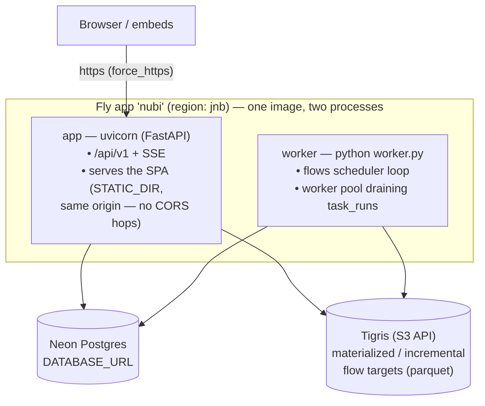

# Nubi Cloud

Nubi Cloud is the **managed, hosted** way to run Nubi. It is a deliberately
**thin layer** on top of the open-source project: the entire product — the
query workspace, dashboards, embedding, Flows orchestration, connectors,
pre-aggregations, AI, and MCP — is the same open-source code you can self-host.
Cloud only adds the things that genuinely require a managed operator.

## What Cloud adds (and self-host doesn't have)

Everything in this section is billing/subscription code — it ships in the
`ee/` tree in every clone of the repo, but is only **switched on** on Nubi
Cloud; a self-host deployment never activates it. The self-host database
schema never even creates these tables (the billing migrations live under
`database/migrations/ee/` and are applied only when the Cloud layer is
active).

- **Billing & subscriptions** — the five plans (Free, Starter, Team, Pro,
  Enterprise), collected via Paystack. See **[Billing, plans & usage wallet](/docs/billing-and-usage)**.
- **Usage wallet** — prepaid credits with manual and automatic top-up and spend
  caps, used to cover metered overages.
- **Overages & metering** — usage beyond your plan's quota (storage, compute,
  AI calls, embedded sessions, agent runs). Prices are **anchored in USD** and
  **billed in ZAR** at a daily-refreshed exchange rate.
- **Invoices** — monthly invoice PDFs (base subscription + overages + VAT where
  applicable), emailed and downloadable from your billing settings.
- **Managed infrastructure & SLA** — hosting, backups, scaling, and (on
  Enterprise) a contractual uptime SLA and dedicated support.

## What's identical to self-host

The product itself. Connectors, queries, parameters, dashboards, the Flows
builder, pre-aggregations, embedding, AI/chat, MCP, organizations, projects,
roles, secrets, and the security/embed-JWT model are the **same open-source
code** whether you run Nubi Cloud or host it yourself. Anything you learn in the
**Using Nubi** section applies to both.

## Cloud vs self-host at a glance

| Capability | Open-source self-host | Nubi Cloud |
|---|---|---|
| Full product (queries, dashboards, flows, embed, AI, MCP) | ✅ | ✅ |
| You operate infra, upgrades, backups | ✅ (your responsibility) | Managed |
| Subscriptions / plans / Paystack billing | — | ✅ |
| Usage wallet, overages, invoices, VAT | — | ✅ |
| USD-anchored pricing billed in ZAR (daily FX) | — | ✅ |
| Uptime SLA + dedicated support | — | ✅ (Enterprise) |

## How Nubi Cloud runs (architecture)

Nubi Cloud runs on **Fly.io** as a single app (`nubi`) in the **`jnb`
(Johannesburg)** region. One combined Docker image — the FastAPI backend with
the built SPA embedded — runs as **two processes**:

- **`app` process** — uvicorn serving the API *and* the built frontend from
  the same origin (the backend's static-SPA mode). All browser calls are
  same-origin, so cookies and embed sessions need no cross-origin setup.
- **`worker` process** — the standalone flows worker
  (scheduler tick + concurrent worker pool). Scheduled flows and queued
  `task_runs` are executed here, never in the request path.
- **Postgres on Neon** — the only system of record. Machines hold no state.
- **Object storage on Tigris** (S3-compatible) — materialized and
  incremental flow targets are written as parquet under
  `FLOWS_MATERIALIZE_BASE_URI`, so they survive machine replacement.
- **Migrations** — the forward-only runner (`database/migrate.py`) executes
  as a Fly `release_command` before each rollout: a throwaway machine applies
  pending migrations, then the new image replaces the old one.
- **Git layer (env-as-branch)** — pushes to GitHub/GitLab go through the
  **provider APIs** (GitHub App installation token or GitLab access token).
  There is no server-side git working tree or daemon, so this too keeps the
  machines stateless and disposable.

### Scaling

| Process | Strategy |
|---|---|
| `app` | Fly's proxy auto-stops idle machines and auto-starts them on demand, with **at least one machine always warm** (`min_machines_running = 1`) so embeds and SSE streams get fast first responses. Concurrency limits: 200 soft / 250 hard requests per machine; add machines as traffic grows. |
| `worker` | Always-on, count 1 (no HTTP service, so the proxy never stops it). Scale horizontally with `fly scale count worker=N` — workers lease `task_runs` so replicas don't collide — or automatically with **fly-autoscaler** keyed on pending `task_runs` queue depth. |

For heavy analytical workloads, register the customer's own warehouse (e.g. BigQuery, Snowflake, Redshift) as a datastore and push queries down through the connector layer — streamed aggregates (`GROUP BY` over filtered scans) scale with dataset size regardless of machine size, and Nubi does not host a warehouse tier of its own.

### Deploy runbook

Nubi Cloud's production deployment — the Fly config, secrets, and deploy
pipeline — lives **in this repo**, at the repo root. There is no separate ops
repo or version pin: a deploy builds the current working tree directly.

- **`fly.toml`** — the canonical Fly config, driving both the `nubi`
  (production, `main` branch) and `nubi-dev` (dev branch) apps with the same
  `app` + `worker` process groups and release-migration step.
- **`setup-fly.sh [main|dev]`** — one-time idempotent app creation.
- **`secrets.sh [main|dev]`** — push `.env` / `.env.dev` to Fly secrets.
- **`./deploy.sh [main|dev]`** — build the Cloud image (`Dockerfile.ee`,
  full tree + billing switched on) from the current tree and roll it out.

`./deploy.sh dev` builds and deploys `nubi-dev`; `./deploy.sh`
promotes the identical build to production (`nubi`). Either path builds the
Cloud image (`Dockerfile.ee`: Vite SPA build → Python deps → runtime) on
Fly's remote builders and rolls out the `app` and `worker` processes; the
`--ee` migrations and Nubi's internal `NUBI_LICENSE_KEY` operations switch are
applied automatically via the release command and Fly secrets — this is
Nubi's own deploy pipeline, not something a self-hoster runs. See
`DEPLOY.md` for the full runbook.

**Self-hosting Nubi yourself?** You supply your own deployment — the same
`Dockerfile` builds the free, full-featured self-host image; bring your own orchestration (Docker
Compose, Fly, Kubernetes, …).

## Pricing

Plans are anchored in **US dollars** and billed in **South African Rand** at a
daily-refreshed exchange rate (with a small buffer); your USD price anchor stays
fixed for the duration of your plan. The full breakdown — what's metered, the
usage wallet, overage rates, and invoices — is in
**[Billing, plans & usage wallet](/docs/billing-and-usage)**.

> Want to run everything yourself instead? See the **Open-source project**
> section, starting with **[Self-hosting](/docs/self-host)**.
