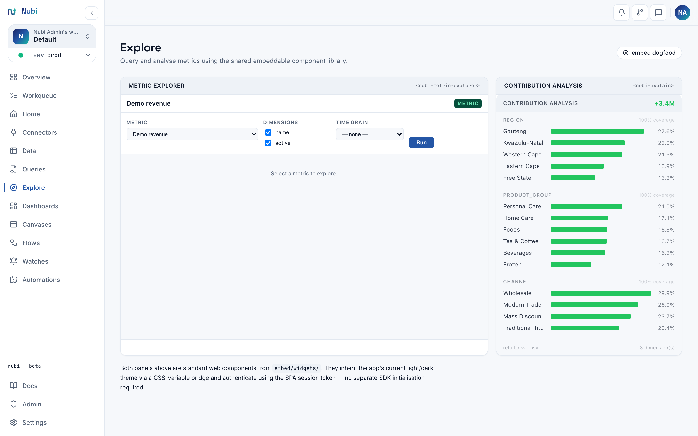
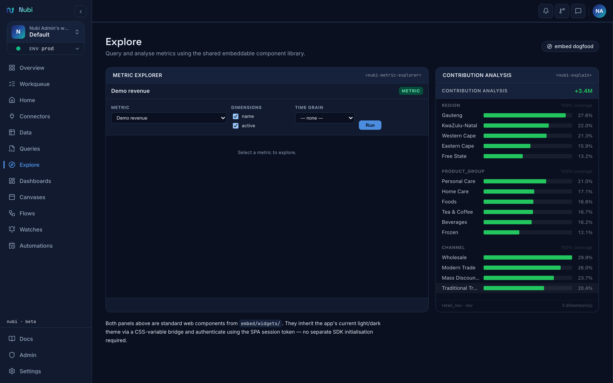

# Embed API — versioned public contract (v1)

This document is the **stable public contract** for the Nubi web-component embed
kit. Hosts pin to a specific bundle version; breaking changes are gated behind a
new major version number. The current version is **v1**.

## Explore — the embedded components in action

Before wiring up the embedding SDK in your own application, you can experience every Nubi web component live inside the app itself. Open **Explore** (`/explore`) in the sidebar — it embeds `<nubi-metric-explorer>` as a first-class app surface, so you can pick a governed metric, apply dimensions, choose a time grain, and see results as a chart and table without writing SQL or leaving the app.

<table><tr>
<td width="50%"><br><sub>Light</sub></td>
<td width="50%"><br><sub>Dark</sub></td>
</tr></table>

Explore demonstrates:

- **`<nubi-metric-explorer>`** — metric picker, dimension toggles, time grain selector, and the governed query run.
- **`<nubi-chart>`** — the result rendered as a chart (bar/line/area auto-detected from the metric's grain).
- **`<nubi-table>`** — the result as a paginated data table below the chart.

When you embed these same components in your own app via the SDK, the experience your users see mirrors what you see in Explore. Use it to prototype dimension combinations and metric selections before committing them to a host page.

---

## Stability and deprecation

- Fields and events marked here are stable for the lifetime of v1.
- Deprecated attributes will remain functional for at least two minor releases
  after the deprecation notice.
- The bundle filename `nubi-embed.js` is stable. The export name `NubiEmbed`
  (UMD global, also present on the ESM) is stable.

---

## Loading the bundle

Build the bundle with:

```bash
npm run build:embed
# Output: embed/dist/nubi-embed.js
```

Add a single `<script type="module">` tag — no import map, no `node_modules`,
no bare specifiers. All dependencies (React 19, apache-arrow, ECharts) are
bundled in:

```html
<script type="module" src="nubi-embed.js"></script>
```

After the script loads every component in the table below is registered as a
custom element and ready to use.

**Monaco editor is NOT bundled.** `<nubi-query-editor>` dynamically imports
Monaco at runtime. Hosts that want the query editor must supply Monaco
separately (CDN or their own bundler). All other components work without it.

Target browsers: Chrome 89+, Firefox 90+, Safari 15+ (native Custom Elements
and Shadow DOM required).

---

## Bundle version

Every build stamps the version from `package.json` into the bundle at compile
time. After the bundle loads you can read the version string from:

| Access point | Example value |
|---|---|
| `window.__nubiVersion` | `"0.0.0"` |
| ESM named export `version` | `"0.0.0"` |
| ESM named export `NUBI_EMBED_VERSION` | `"0.0.0"` |

```js
import { version } from './nubi-embed.js'
console.log(window.__nubiVersion) // also available globally
```

### Versioned bundle path convention

The build produces two artifacts:

| File | Usage |
|------|-------|
| `embed/dist/nubi-embed.js` | Stable "latest" alias. Always points to the most recent build. |
| `embed/dist/nubi-embed-<version>.js` | Pinned version. Safe for long-cache headers. |

Pin to a specific version in production by serving the versioned file:

```html
<script type="module" src="nubi-embed-0.0.0.js"></script>
```

---

## Token resolution

Every component resolves its bearer token through three mechanisms, checked in
priority order:

| Priority | Mechanism | Meaning |
|----------|-----------|---------|
| 1 (highest) | `.getToken` instance property | An async function set directly on the element: `el.getToken = async () => fetchToken()`. Useful for programmatic integration without touching HTML attributes. |
| 2 | `token` attribute | A static JWT string baked into the HTML. Useful for server-side rendering. |
| 3 | `get-token` attribute | The name of a `window.*` function that returns `string \| Promise<string>`. Called before every request so short-lived tokens can be refreshed. |

```js
// Highest-priority: set the property directly on the element
const el = document.querySelector('nubi-dashboard')
el.getToken = async () => {
  const res = await fetch('/auth/token')
  return res.text()
}
```

```html
<!-- Static token via attribute -->
<nubi-kpi token="eyJ..." query-id="revenue"></nubi-kpi>

<!-- Dynamic token via window function name -->
<nubi-kpi get-token="getMyToken" query-id="revenue"></nubi-kpi>
<script>
  window.getMyToken = async () => fetchToken()
</script>
```

If none of the three mechanisms is configured and `query-id` / `metric-id`
is present, requests are made without an Authorization header (demo / public
boards only).

---

## Component reference

### `<nubi-dashboard>`

Read-only dashboard embed. Loads a published dashboard by ID and renders its
widgets with live cross-filtering.

| Attribute | Required | Meaning |
|-----------|----------|---------|
| `get-token` / `token` | See above | Bearer JWT |
| `backend` | No | API base URL. Default `http://localhost:8000`. |
| `query` | Yes | Published dashboard ID or query slug to embed. |
| `theme` | No | `"dark"` (default) or `"light"`. |

---

### `<nubi-kpi>`

Big-number metric card. Executes a registered query and displays the first row's
value, with optional KPI-target rendering.

| Attribute | Required | Meaning |
|-----------|----------|---------|
| `get-token` / `token` | — | Bearer JWT |
| `backend` | No | API base URL. Default `http://localhost:8000`. |
| `query-id` | Yes | Registered query ID. |
| `value-col` | Yes | Column name to read the KPI value from (first row). |
| `label` | No | Display label. Defaults to `value-col`. |
| `format` | No | `"number"` (default, auto-compact), `"currency"`, `"percent"`, `"integer"`. |
| `target-col` | No | Column holding the target value (e.g. `"revenue_target"`). When set, enables KPI-target rendering (goal bar, % to goal, RAG chip). |
| `rag-col` | No | Column for RAG status string (`"green"` / `"amber"` / `"red"`). Defaults to `"<value-col>_rag"` when `target-col` is set. |
| `pct-col` | No | Column for pct-to-goal ratio. Defaults to `"<value-col>_pct_to_goal"` when `target-col` is set. |

When `target-col` is absent (or the column is not in the result) no target UI
is rendered — the widget is backward-compatible with queries that do not include
target columns.

**Events emitted:**
- `nubi:widget-ready` — `{ rows, renderer: "kpi" }` — data loaded successfully.
- `nubi:widget-error` — `{ message }` — fetch or render failed.

**Sample fallback:** any fetch failure renders a clearly-labelled sample card so
demo pages always display something meaningful.

### Inline data injection

All vanilla widgets (`<nubi-kpi>`, `<nubi-table>`, `<nubi-chart>`) accept a `data` attribute for static/SSR embeds:

| Attribute | Widgets | Meaning |
|-----------|---------|---------|
| `data` | kpi, table, chart | Inline JSON data. When present, skips all fetching and renders directly. Array of row objects for kpi/table/chart. |
| `no-sample-fallback` | kpi, table, chart | Boolean. When set, a fetch failure renders a clean error state instead of sample data. Default: show sample (back-compat). |

**Example — static KPI with target and RAG:**

```html
<nubi-kpi
  value-col="revenue"
  label="Revenue"
  format="currency"
  target-col="revenue_target"
  rag-col="revenue_rag"
  pct-col="revenue_pct_to_goal"
  data='[{"revenue":124500,"revenue_target":100000,"revenue_pct_to_goal":1.25,"revenue_rag":"green"}]'
></nubi-kpi>
```

**Example — suppress sample fallback on fetch failure:**

```html
<nubi-kpi
  no-sample-fallback
  query-id="revenue"
  value-col="revenue"
  backend="https://api.example.com"
></nubi-kpi>
```

---

### `<nubi-kpi-react>`

React-based KPI card. Same attribute surface as `<nubi-kpi>` (excluding
KPI-target attributes). Implemented with the `defineNubiElement` factory
(`embed/react-wc.js`) which wraps a React component in an open shadow root.

| Attribute | Required | Meaning |
|-----------|----------|---------|
| `get-token` / `token` | — | Bearer JWT |
| `backend` | No | API base URL. Default `http://localhost:8000`. |
| `query-id` | Yes | Registered query ID. |
| `value-col` | Yes | Column to read the KPI value from. |
| `label` | No | Card heading. |
| `format` | No | `"number"` / `"currency"` / `"percent"` / `"integer"`. |
| `theme` | No | `"dark"` (default) or `"light"`. Changing this attribute re-applies the theme CSS without a full re-mount. |

---

### `<nubi-chart>`

Auto chart using ECharts. Reads Arrow IPC from `POST /query` and picks a chart
type automatically. Switches to a WebGL scatter path above ~20,000 rows.

| Attribute | Required | Meaning |
|-----------|----------|---------|
| `get-token` / `token` | — | Bearer JWT |
| `backend` | No | API base URL. |
| `query-id` | Yes | Registered query ID. |
| `chart-type` | No | Override: `"bar"`, `"line"`, `"scatter"`, `"pie"`, `"area"`. Auto-detected when absent. |
| `x-col` | No | Column for the X axis. Auto-selected when absent. |
| `y-col` | No | Column for the Y axis / value. Auto-selected when absent. |
| `theme` | No | `"dark"` / `"light"`. |

---

### `<nubi-table>`

Data table for query results. Renders Arrow IPC rows as a paginated HTML table.

| Attribute | Required | Meaning |
|-----------|----------|---------|
| `get-token` / `token` | — | Bearer JWT |
| `backend` | No | API base URL. |
| `query-id` | Yes | Registered query ID. |
| `page-size` | No | Rows per page (default `50`). |
| `theme` | No | `"dark"` / `"light"`. |

**Events emitted:**
- `nubi:select` — `{ column, value, row }` — user clicked a cell.

---

### `<nubi-query-editor>`

Scope-gated SQL / metric query workspace. Requires the host to supply Monaco
editor separately (the bundle excludes it due to its ~7 MB size).

| Attribute | Required | Meaning |
|-----------|----------|---------|
| `get-token` / `token` | — | Bearer JWT |
| `backend` | No | API base URL. |
| `query-id` | No | Pre-load a registered query by ID. |
| `mode` | No | `"sql"`, `"metric"`, or `"auto"` (default). Auto detects from the loaded query. |
| `theme` | No | `"dark"` (default) / `"light"`. |
| `read-only` | No | Boolean attribute; forces read-only regardless of token scopes. |

**Capability gating** (cosmetic UI — the server is the real enforcement gate):

| Scope in token | Effect |
|----------------|--------|
| `author:sql` | SQL mode tab available; editor editable; Run and Save buttons enabled. |
| `author:metric` | Metric mode tab available; editor editable; Run and Save buttons enabled. |
| Neither | Editor locked; no run/save buttons (read-only indicator shown). |

**Events emitted:**
- `nubi:run` — `{ sql, queryId, params }` — user ran the query.
- `nubi:save` — `{ sql, queryId, name }` — user saved.
- `nubi:dirty` — `{ dirty: boolean }` — editor content diverged from or returned to saved state.
- `nubi:error` — `{ message, code }` — error occurred.

**Monaco shadow-DOM note**: Monaco injects styles into `document.head` and does
not work inside a shadow root. The editor mounts in a light-DOM wrapper
positioned absolutely over the shadow-root placeholder, aligned via a
ResizeObserver.

---

### `<nubi-metric-explorer>`

Governed metric query builder. No raw SQL surface. Provides a UI to pick a
metric, dimensions, and time grain, then runs the governed metric query via
`POST /metrics/{id}/query`.

| Attribute | Required | Meaning |
|-----------|----------|---------|
| `get-token` / `token` | — | Bearer JWT |
| `backend` | No | API base URL. |
| `metric-id` | No | Pre-select a metric by ID/slug. |
| `dimensions` | No | Comma-separated default selected dimensions. |
| `theme` | No | `"dark"` (default) / `"light"`. |

**Capability gating:**

| Scope | Effect |
|-------|--------|
| `author:metric` | Controls enabled; Run button visible. |
| No `author:metric` | Controls shown but disabled; read-only indicator displayed. |

**Events emitted:**
- `nubi:run` — `{ metricId, dimensions, timeGrain }` — query executed.
- `nubi:select` — `{ column, value, row }` — user selected a result row/cell.
- `nubi:error` — `{ message, code }` — error occurred.

---

### `<nubi-lineage>`

Interactive dependency DAG visualisation. Fetches from `GET /api/v1/lineage/dag`
(full graph) or `GET /api/v1/lineage/dag/{node-id}?hops=N` (neighbourhood view)
and renders a columnar SVG layout (table → query → metric columns, nodes as
rounded rectangles, edges as curved paths).

| Attribute | Required | Meaning |
|-----------|----------|---------|
| `get-token` / `token` | — | Bearer JWT |
| `backend` | No | API base URL. Default `http://localhost:8000`. |
| `theme` | No | `"dark"` (default) / `"light"`. |
| `node-id` | No | When set, fetches the neighbourhood of this node id instead of the full DAG. |
| `hops` | No | Traversal depth when `node-id` is set (default `2`, max `20`). |
| `no-sample-fallback` | No | Boolean. When present, shows an error state instead of sample data on failure. |

**Events emitted:**
- `nubi:select` — `{ node }` — user clicked a DAG node. `node` is the full node
  object `{ id, type, name, tables, outputs, columns }`.
- `nubi:widget-ready` — `{ nodes, edges, renderer: "lineage" }` — data loaded.
- `nubi:widget-error` — `{ message }` — fetch failed.

**Sample fallback:** when no backend is configured or the request fails, the
widget renders a 4-node / 3-edge sample DAG (orders → revenue query → revenue
metric) so demo pages always display content.

**Example:**

```html
<!-- Full DAG -->
<nubi-lineage get-token="getMyToken" backend="https://api.example.com"></nubi-lineage>

<!-- Neighbourhood of a single node, 3 hops -->
<nubi-lineage
  get-token="getMyToken"
  backend="https://api.example.com"
  node-id="revenue_metric"
  hops="3"
></nubi-lineage>
```

---

### `<nubi-health>`

Data-health score + freshness dashboard widget. Fetches health scores from
`GET /api/v1/health/score` and freshness from `GET /api/v1/health/freshness`
(or the `?dataset_key=` single-dataset variants) and renders:

- A circular gauge showing the overall score and grade letter (averaged across
  datasets when showing multiple).
- A reasons list from the score response.
- A freshness table with RAG status dots (green = fresh, amber = stale < 24 h,
  red = stale > 24 h).

| Attribute | Required | Meaning |
|-----------|----------|---------|
| `get-token` / `token` | — | Bearer JWT |
| `backend` | No | API base URL. Default `http://localhost:8000`. |
| `theme` | No | `"dark"` (default) / `"light"`. |
| `dataset-key` | No | When set, filters score and freshness to a single dataset. |
| `no-sample-fallback` | No | Boolean. When present, shows an error state instead of sample data. |

**Events emitted:**
- `nubi:widget-ready` — `{ score, grade, datasets, renderer: "health" }` — data
  loaded. `datasets` is an array of `{ dataset_key, score, grade, fresh, last_updated, status }`.
- `nubi:widget-error` — `{ message }` — fetch failed.

**Sample fallback:** renders sample health data (4 datasets, mixed fresh/stale
statuses) when no backend is configured or the request fails.

**Example:**

```html
<!-- All datasets for the org -->
<nubi-health get-token="getMyToken" backend="https://api.example.com"></nubi-health>

<!-- Single dataset health card -->
<nubi-health
  get-token="getMyToken"
  backend="https://api.example.com"
  dataset-key="raw/orders"
></nubi-health>
```

---

## DOM events (outbound contract)

All events bubble and are `composed: true` so they pierce shadow DOM boundaries
and reach host-document listeners. Listen on the component element or any
ancestor:

```js
document.querySelector('nubi-query-editor').addEventListener('nubi:run', e => {
  console.log(e.detail.sql)
})
```

| Event | Payload (`e.detail`) | Emitting components |
|-------|---------------------|---------------------|
| `nubi:run` | `{ sql?, queryId?, metricId?, dimensions?, timeGrain?, params? }` | query-editor, metric-explorer |
| `nubi:save` | `{ queryId?, sql?, name? }` | query-editor |
| `nubi:dirty` | `{ dirty: boolean }` | query-editor |
| `nubi:select` | `{ column?, value?, row?, node? }` | table, metric-explorer, lineage |
| `nubi:widget-ready` | `{ rows?, renderer: string, nodes?, edges?, score?, grade?, datasets? }` | kpi, lineage, health |
| `nubi:widget-error` | `{ message: string }` | kpi, lineage, health |
| `nubi:error` | `{ message: string, code?: string }` | query-editor, metric-explorer |

---

## Theme contract (25 tokens)

Every component accepts a `theme` attribute (`"dark"` or `"light"`) and
exposes all 25 CSS custom properties for fine-grained host overrides. Set them
on the host element or in a parent `<style>`:

```css
nubi-kpi {
  --nubi-primary: #7c3aed;
  --nubi-bg: #0a0a0a;
}
```

| Token | Dark default | Light default | Role |
|-------|-------------|---------------|------|
| `--nubi-bg` | `#0f1117` | `#ffffff` | Primary background |
| `--nubi-bg-2` | `#1a1f2e` | `#f8f9fc` | Secondary background (toolbars) |
| `--nubi-bg-3` | `#1e2433` | `#f1f3f7` | Tertiary background |
| `--nubi-fg` | `#e2e8f0` | `#1a202c` | Primary foreground text |
| `--nubi-fg-muted` | `#718096` | `#718096` | Muted / secondary text |
| `--nubi-accent` | `#1e2433` | `#edf2f7` | Surface / accent fill |
| `--nubi-border` | `#2d3748` | `#e2e8f0` | Border / divider |
| `--nubi-primary` | `#6366f1` | `#4f46e5` | Brand / interactive primary |
| `--nubi-primary-fg` | `#ffffff` | `#ffffff` | Text on primary background |
| `--nubi-success` | `#10b981` | `#059669` | Success / green |
| `--nubi-warning` | `#f59e0b` | `#d97706` | Warning / amber |
| `--nubi-error` | `#ef4444` | `#dc2626` | Error / red |
| `--nubi-radius` | `8px` | `8px` | Border radius (large) |
| `--nubi-radius-sm` | `4px` | `4px` | Border radius (small) |
| `--nubi-font-sans` | `system-ui, …` | `system-ui, …` | Sans-serif font stack |
| `--nubi-font-mono` | `'Fira Code', …` | `'Fira Code', …` | Monospace font stack |
| `--nubi-font-size-base` | `13px` | `13px` | Base font size |
| `--nubi-font-size-sm` | `11px` | `11px` | Small font size |
| `--nubi-font-size-xs` | `10px` | `10px` | Extra-small font size |
| `--nubi-line-height` | `1.5` | `1.5` | Default line height |
| `--nubi-toolbar-h` | `36px` | `36px` | Toolbar height |
| `--nubi-z-editor` | `100` | `100` | Editor z-index layer |
| `--nubi-z-overlay` | `200` | `200` | Overlay z-index layer |
| `--nubi-z-popover` | `300` | `300` | Popover z-index layer |
| `--nubi-transition` | `0.15s ease` | `0.15s ease` | Default CSS transition |

---

## Capability gating and server enforcement

Scope-gated components (`nubi-query-editor`, `nubi-metric-explorer`) decode the
JWT payload client-side to show or hide UI controls. This is **cosmetic only**.
The server is the real enforcement gate:

- `author:sql` is required by the backend to accept and execute raw SQL.
- `author:metric` is required to save metric definitions.
- `read:*` / `read:query` is required for all data queries.

Removing a scope from the client-side token is not a security measure — the
server will reject the request regardless. The client-side gating only improves
UX by hiding inaccessible controls.

Scope decoding is provided by `decodeScopes(token)` and `hasScope(scopes, required)`
in `embed/nubi-context.js`. These functions never verify the token signature —
they only parse the payload for UI purposes.

---

## Cross-filter event bus (`NubiContext`)

For multi-widget pages where components should cross-filter each other, use
`createNubiContext` from `embed/nubi-context.js` to create a shared event bus:

```js
import { createNubiContext } from './nubi-embed.js'

const ctx = createNubiContext({
  getTokenFn: window.getToken,
  backend: 'https://api.example.com',
})

// Broadcast a filter from any source
ctx.emitFilter('region', 'EMEA')

// Subscribe in any component
const unsub = ctx.onFilter(({ column, value }) => {
  console.log('filter changed:', column, value)
})
```

The bus is an in-page `EventTarget`; it does not make any network requests.

---

## OpenAPI schema

The FastAPI app auto-generates an OpenAPI schema available at runtime at:

```
GET /openapi.json
```

(In development mode the interactive Swagger UI is at `/docs`.)

To dump a static snapshot, run with the app's Python environment active:

```bash
cd backend
python -c "
import json, sys
sys.path.insert(0, '.')
from main import app
print(json.dumps(app.openapi(), indent=2))
" > ../docs/openapi.json
```

Importing `main` requires the full backend environment (database drivers,
etc.). In CI without a live DB this import will fail; the recommended approach
is to hit `GET /openapi.json` against a running dev instance and pipe the
output to `docs/openapi.json`. A committed snapshot is not included in this
repo for that reason — rely on the live `/openapi.json` route or generate it
from a running instance.
