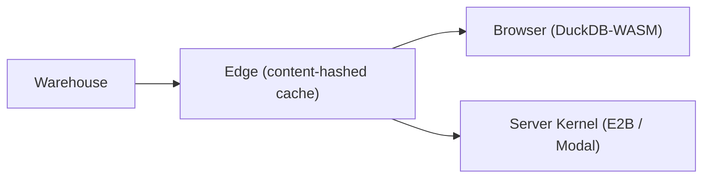

# Nubi Documentation

Nubi is a batteries-included BI and embedded-analytics platform. The kernel runs **in the user's browser** by default (DuckDB-WASM), so the marginal cost of a dashboard view is approximately zero. A server kernel (E2B / Modal Firecracker microVM) handles native wheels and large jobs when needed.

---

## What Nubi Is

**Embedded-first** — the core surface is embedding: a host app signs short-lived JWTs, mounts `<nubi-dashboard>`, and gets live cross-filtering dashboards with server-enforced row-level security at near-zero cost per view.

**BYO warehouse** — point at any Postgres-compatible warehouse (Neon, RDS, AlloyDB) or bring your own connector. Nubi does not own your data.

**AI-native** — grounded text-to-SQL (`POST /api/v1/ai/sql`), natural-language dashboard generation (`POST /api/v1/ai/dashboard`), an agentic chat loop with a 14-tool registry (`POST /api/v1/ai/chat`), and a full MCP server so Claude and other agents can author dashboards directly.

**Arrow-native data plane** — data moves as Arrow IPC at every boundary (warehouse → edge cache → browser) with no JSON round-trip tax.

---

## Start Here

### Using Nubi

| | |
|---|---|
| [**Quickstart**](/docs/quickstart) | Clone → `seed.py --demo` → run → first dashboard in 5 minutes; demo data reference; admin@nubi.dev credentials |
| [**Getting Started**](/docs/getting-started) | Sign up on Nubi Cloud, connect a source, run your first query, build your first board; Free plan limits |
| [**UI Tour**](/docs/ui-tour) | A guided walk through the app shell — sidebar, topbar, and every page |
| [**Connectors**](/docs/connectors) | Postgres, DuckDB (in-mem + file), HttpJson, MySQL/MariaDB, JDBC, BYO warehouse, 7-flag capability contract, Data Browser |
| [**Queries & Parameters**](/docs/queries-and-params) | Registered queries, `{{named}}` typed params, query library, text-to-SQL |
| [**Pre-Aggregations**](/docs/pre-aggregations) | Auto rollups mined from the query log, ranked by frequency × scanned-bytes, RLS-preserving, transparent routing with HIT counts |
| [**Dashboards**](/docs/dashboards) | DashboardSpec, widget types (kpi/metric/chart/table/pivot/filter/text/section), 9 chart types, variables, `/d/:id?var=` route params |
| [**Exports & Scheduled Reports**](/docs/exports-and-jobs) | CSV/PDF exports, cron jobs, per-recipient locked params |
| [**Flows**](/docs/flows) | Cell-based orchestrator with 3 cell types (SQL, Python, Note); notebook and canvas (DAG) views; retries, durable run history, scheduling, cross-cell data references |
| [**Notebooks**](/docs/notebooks) | The notebook view of a Flow spec — CellSpec/NotebookSpec data model, cross-cell data flow, preview vs. durable execution runtimes, cross-engine SQL (`source_dialect`) |
| [**Semantic layer, data apps & close-the-loop**](/docs/semantic-and-data-apps) | Governed metric definitions; derived/ratio measures; time intelligence; dynamic top-N; pre-agg rollups; Flows as a data-app engine (per-cell resources, stochastic seeds, artifact channel, sweep/backfill, triggers); the close-the-loop architecture |
| [**Metrics reference**](/docs/metrics-reference) | Agent/MCP reference for declaring and querying governed metrics via `POST /metrics/{id}/query` |
| [**Data Health**](/docs/data-health) | Freshness registry (`GET /health/freshness`), weighted health scoring (`GET /health/score`), estate graph |
| [**Transformation**](/docs/transformation) | Flow spec version history + revert, env pinning, `POST /transpile` (SQL dialect conversion) |
| [**Materialization**](/docs/materialization) | Named managed tables for flows — materialize-once, serve-many caching for expensive projections; `full` / `incremental` Parquet targets, query registry wiring, RLS, watermarks |
| [**Governance**](/docs/governance) | RLS policy schema (scalar/list/range), hierarchical scope expansion, authoring scopes (`author:sql`, `author:metric`) |
| [**AI, Chat & MCP**](/docs/ai-and-mcp) | Grounded ask, agentic chat, 14 agent tools, MCP server (14 tools) |
| [**MCP integration**](/docs/mcp) | Host integration contract: registering external MCP servers, agent tool dispatch, Nubi as MCP server (JSON-RPC, tool catalog, auth) |
| [**Embedding**](/docs/embedding) | JWT minting (RS256/ES256), per-viewer RLS, token-locked params, `<nubi-dashboard>` |
| [**Embed API v1**](/docs/embed-api) | Versioned public contract for the web-component kit — all attributes, events, 25-token theme contract, capability gating, `NubiContext` cross-filter bus |
| [**Organization & Settings**](/docs/organization-settings) | Members, roles and invites; integrations; usage; project settings and the Git connection |
| [**Notifications & Integrations**](/docs/notifications-and-integrations) | Per-org email integration, in-app notification feed, Web Push — one outbound channel (email); the embedding host owns Slack/Teams/etc. |
| [**How-to guides**](/docs/how-to) | Worked examples: semantic metrics (define/query/derive/time-intel/top-N); pre-agg build; Flows sweep/backfill/triggers; DataProvider boards |
| [**API Reference**](/docs/api-reference) | Full HTTP API reference — /metrics, /flows sweep/backfill/triggers, /boards/providers/data, /variables |

### Nubi Cloud

| | |
|---|---|
| [**Nubi Cloud**](/docs/cloud) | The managed, hosted way to run Nubi — what differs from self-host |
| [**Billing & Usage**](/docs/billing-and-usage) | 5 tiers (Free / $9 / $49 / $149 / $1,000-floor), ZAR billing with USD anchoring, metered usage wallet, unlimited seats at every tier — billing itself is **EE-only** |
| [**Billing Model**](/docs/billing-model) | The COGS-mapping principle behind what's metered (and deliberately what isn't); authoritative tier values |

### Open-source project

| | |
|---|---|
| [**Capability Matrix**](/CAPABILITIES.md) | What's shipped vs. partial / roadmap / out-of-scope — the host-trackable capability contract (routes, components, status) |
| [**Changelog**](/CHANGELOG.md) | Notable host-visible changes (Keep a Changelog format) |
| [**Self-Host**](/docs/self-host) | Detailed deployment guide — Docker Compose, SSL, managed Postgres, production hardening |
| [**Open Core**](/docs/open-core) | The CE/EE split — what's open source and what stays EE (billing, Paystack, cloud) |
| [**Open-Core Architecture**](/docs/architecture-open-core) | Feature-gate API, Docker CE/EE images, how EE billing slots in |
| [**Architecture & Economics**](/docs/architecture-and-economics) | The compute-placement model, embedding modes, and how each maps to billing COGS |
| [**Compliance**](/docs/compliance) | Posture document (not a certification) — implemented controls today, gaps disclosed, POPIA/GDPR-relevant custody controls |
| [**Connector Security**](/docs/connector-security) | AES-256-GCM secret encryption, key rotation, network modes |
| [**Kernel Security**](/docs/kernel-security) | The two-kernel trust boundary — browser DuckDB-WASM vs. server Python sandbox |
| [**Compute-Kernel Attribution Runner**](/docs/compute-kernel-attribution-runner) | Domain-agnostic bring-your-own-model attribution runner on the sandboxed kernel — submit Python + Arrow arrays + a serialized model, get attribution values back; carries no domain semantics |
| [**Cache-Key Spec**](/docs/cache-key-spec) | The result cache keyed on SQL, params, and RLS policies |
| [**Conformance**](/docs/conformance) | The M1-C conformance suite every executor must pass |
| [**Observability**](/docs/observability) | Dependency-free request-latency percentiles, ops stats endpoint, SLOs, and the per-org rate-limit classes |
| [**Secrets**](/docs/secrets) | Org-scoped encrypted secrets, `{{ secrets.NAME }}` in flows, `nubi secrets set/list` |
| [**SDK & CLI**](/docs/sdk-and-cli) | `@nubi/sdk` JavaScript client and the `nubi` Python CLI (`login` / `init` / `pull` / `push` / `deploy` / `run` / `diff` / `flows` / `secrets`) |
| [**Files-as-Code**](/docs/files-as-code) | The local project format — flows, queries, and dashboards as committed files; CLI round-trips and CI/CD |
| [**Git Sync**](/docs/git-sync) | GitHub App + GitLab push; commit queries and dashboards as code |
| [**Bridges**](/docs/bridges) | Agent-per-VPC reverse tunnel, WebSocket protocol, reachability modes |
| [**Developing Nubi**](/docs/development) | Contributor guide — dev stack, seeding, test suites, repo layout, conventions |
| [**Docs & Screenshots**](/docs/docs-and-screenshots) | How docs are authored and registered; the automated screenshot pipeline |

---

## Architecture Overview

The planner translates SQL through sqlglot into a `PhysicalPlan`, injects RLS predicates as AST-level predicates (never string-concatenated), checks the content-hashed cache, then streams Arrow IPC to the caller.

---

## Key Concepts

> **Arrow-native** — Data moves as Arrow IPC at every boundary. No JSON round-trips, no ORM overhead.

> **Content-hashed cache** — `cache_key = SHA-256(canonical_json({sql, params, rls_claims}))`. Identical queries with identical RLS context share one cache slot. N viewers collapse to one warehouse hit.

> **Server-side RLS** — JWT `policies` claims are injected as AST predicates by the planner. The browser never sees unfiltered data. Embed tokens cannot execute arbitrary SQL — they must reference server-registered queries.

> **LLM-authorable dashboards** — Dashboards are sanitized HTML/CSS composed of `<nubi-kpi>`, `<nubi-table>`, `<nubi-chart>`, `<nubi-filter>`, and `<nubi-text>` custom elements. DOMPurify strips scripts and event handlers.

---

## Tech Stack

| Layer | Technologies |
|---|---|
| Backend | FastAPI 0.131, Python 3.11+, uvicorn, pydantic-settings v2 |
| DB | asyncpg (connection pool, raw SQL); Postgres 16 / Neon (SSL required) |
| Auth | argon2-cffi (argon2id), PyJWT HS256, cryptography RS256/ES256 JWKS |
| Data plane | sqlglot (AST planner + RLS injection), pyarrow, DuckDB, adbc-driver-postgresql |
| Cache | In-process LRU + TTL (`ContentAddressedCache`); Redis-swappable interface |
| Compute | subprocess (dev); e2b-code-interpreter / modal (prod, Firecracker microVM) |
| Frontend | React 19, Vite 7, TailwindCSS, react-router-dom |
| Viz | regl (WebGL scatter, ~1M pts), apache-arrow, @duckdb/duckdb-wasm |
| Embed | Custom elements (`<nubi-dashboard>`, `<nubi-kpi>`, `<nubi-table>`, `<nubi-chart>`, `<nubi-filter>`, `<nubi-text>`), DOMPurify |
| SDK | `@nubi/sdk` — framework-agnostic ESM, wraps auth + query + resources + embed |
| CLI | Python typer (`nubi login / init / pull / push / deploy / run / diff / flows / secrets`) |
| MCP | Python `mcp` SDK, stdio transport, 14 tools |
