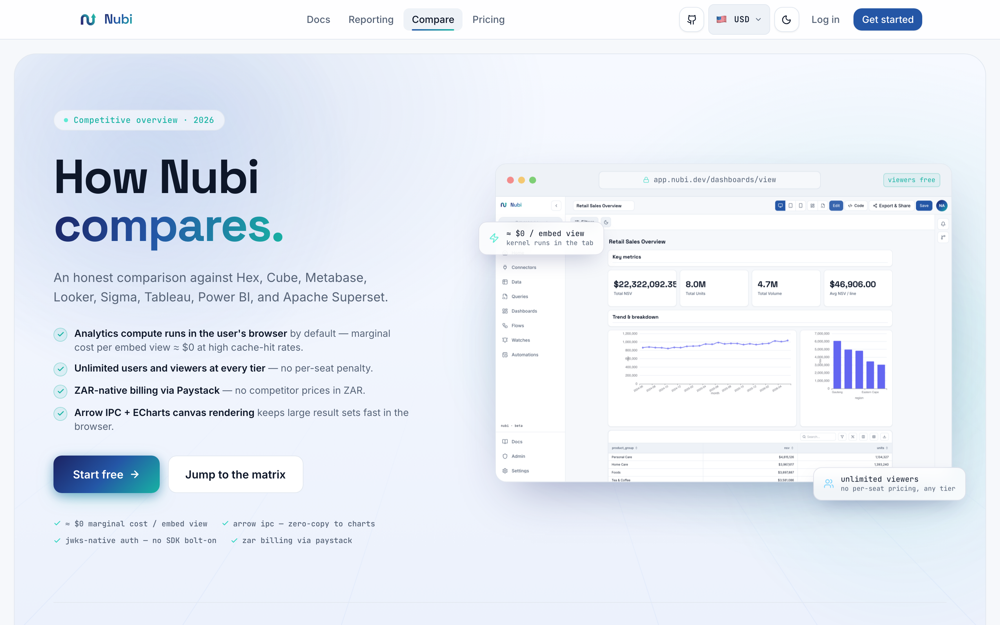

# Nubi Open Source + Cloud


Nubi is **open source, full stop** — there is no separate "self-hosted paid"
or "Enterprise Edition" license to buy. Self-hosting gets you the complete
product for free, with billing and quota enforcement switched off. **Nubi
Cloud** is our own hosted deployment of the exact same code, with billing
switched on.

The billing, wallet, and FX code that Nubi Cloud runs lives in a separate
`ee/` tree purely for **code organization** — it ships in this repo, in
every clone, same as everything else. It is not a paywalled add-on and
there is no product or SKU a self-hoster purchases to unlock it.

---

## Two ways to run Nubi

| | Self-host (you run it) | Nubi Cloud (we run it) |
|---|---|---|
| Code | The full repo, including `ee/` | The full repo, including `ee/` |
| Cost | Free | Paid plans — see [Billing & Usage](/docs/billing-and-usage) |
| Billing / wallet / quota enforcement | Off | On |
| Who sets `NUBI_LICENSE_KEY` | Nobody — leave it unset | Only Nubi's own Cloud deployment |

`NUBI_LICENSE_KEY` is **not a product you buy**. It's an internal operations
switch that only Nubi's own Cloud infrastructure sets, so the same codebase
knows to turn billing on for the environments Nubi operates. Self-hosters
never need it, never set it, and lose nothing by leaving it unset — every
feature outside of billing is available unconditionally.

---

## Repository layout

```
nubi/
├── backend/
│   ├── main.py                    ← calls load_ee() at startup (try/except)
│   └── app/
│       ├── features.py            ← feature-gate registry (core, no ee import)
│       ├── routes/                ← core routes
│       └── ee/                    ← billing code, ships in the repo
│           ├── __init__.py        ← load_ee() + ee_startup() entry points
│           ├── licensing/
│           │   └── license.py     ← Tier enum + NUBI_LICENSE_KEY resolution
│           └── billing/
│               ├── tiers.py       ← BillingTier limits, overage rates
│               ├── quota.py       ← quota enforcement
│               ├── paystack.py    ← Paystack integration
│               ├── wallet.py      ← prepaid credit wallet
│               ├── fx.py          ← USD→ZAR FX conversion
│               ├── invoice.py     ← invoice generation
│               └── routes.py      ← /ee/billing/** routes (mounted by load_ee)
├── src/
│   ├── lib/features.js            ← core feature-flag store
│   └── ee/                        ← billing UI, ships in the repo
│       ├── index.js               ← registerEe() dynamic import entry
│       ├── registry.js            ← slot registry
│       └── billing/               ← billing UI components
│           ├── registerBilling.js
│           ├── BillingPage.jsx
│           ├── WalletPanel.jsx
│           ├── PricingCalculator.jsx
│           ├── UpgradePrompt.jsx
│           └── FxNotice.jsx
├── database/
│   └── migrations/
│       ├── *.sql                  ← core schema (applied by default)
│       └── ee/
│           ├── 0017_billing.sql
│           ├── 0018_fx_rates.sql
│           ├── 0022_wallet.sql
│           └── 0027_invoices.sql  ← billing schema (--ee / NUBI_EE=1 only)
└── LICENSE                        ← Apache-2.0 (whole repo)
```

---

## The no-import rule

**Core code must never import from `app.ee` or `src/ee/`.**

This is the single most important rule. Violating it means self-host deployments would break if the `ee/` tree were ever removed from a build. The rule is enforced by code review and the test suite (which must pass with no EE env vars set).

1. Core never imports `app.ee`. It only asks the gate: `feature_enabled("billing")` → `False` unless the billing code registers a passing checker, `feature_enabled("flows")` → `True` (a core feature: allow by default).
2. At startup, `load_ee()` lazy-imports the `ee/` sub-modules; each one calls `register_feature()` to plug in its checker, and `load_ee()` mounts the `/ee/**` routes.

`/ee/billing` routes are mounted by `load_ee()` from inside the `ee/` tree. Core never calls `application.include_router` for any billing router directly.

---

## Feature gate

`backend/app/features.py` is the single source of truth for "is feature X available?". Core code calls `feature_enabled()`; the billing code calls `register_feature()` at startup.

```python
# core — ask whether a feature is available
from app.features import feature_enabled

if feature_enabled("billing"):
    ...  # only reached when billing is switched on (Nubi Cloud)
```

```python
# billing code — register a checker at startup (called from load_ee())
from app.features import register_feature, declare_commercial

declare_commercial("my_feature")          # deny by default unless registered
register_feature("my_feature", checker)   # checker: () -> bool
```

Key design choices verified in `backend/app/features.py`:

- **Billable feature names** (`"billing"`, `"paid_tiers"`, and any name passed to `declare_commercial()`) **default to `False`** unless the billing code registers a passing checker — this is why plain self-host, with `NUBI_LICENSE_KEY` unset, never has billing switched on.
- **All other feature names default to `True`** — self-host users get every non-billing feature without any configuration.
- A checker that raises is caught and treated as `False`; a broken billing module never crashes request handling.

### Quota enforcement

Core routes call `enforce_quota()` before metered operations (AI calls, embed sessions, compute). In a self-host deployment no quota checker is registered, so the call is a no-op (allow all — self-host is never usage-limited). Nubi Cloud's billing code registers an async checker via `register_quota_checker()`.

```python
from app.features import enforce_quota

await enforce_quota(org_id, "ai_calls", amount=1.0)
# → no-op in self-host; raises AppError("quota_exceeded", ..., 402) on Nubi Cloud when the quota is exceeded
```

---

## Startup sequence

### Self-host (default — `NUBI_LICENSE_KEY` unset)

`backend/main.py` wraps the `ee/` load in `try/except`:

```python
try:
    from app.ee import load_ee        # noqa: PLC0415
    _ee_loaded = load_ee(application)
    if not _ee_loaded:
        logger.debug("Running without billing (commercial features disabled)")
except Exception as _ee_exc:
    logger.warning("Nubi EE loader raised an unexpected error (non-fatal, billing disabled): %s", _ee_exc)
```

The `ee/` tree still ships and loads normally in a self-host deployment — nothing needs to be stripped out. Because `NUBI_LICENSE_KEY` is unset, the billing feature checkers all resolve to `False`, so every billing-gated code path stays off and every other feature works normally.

### Nubi Cloud (our deployment sets `NUBI_LICENSE_KEY`)

1. `main.py` calls `load_ee(app)`.
2. `load_ee` lazy-imports **licensing** first (determines active tier from the internal `NUBI_LICENSE_KEY` switch), then **billing** (registers checkers, mounts `/ee/billing` routes). Each sub-module is wrapped in its own `try/except` so one broken sub-module does not abort the rest.
3. `load_ee` returns `True` and logs which sub-modules loaded.
4. After the DB pool is ready, the FastAPI lifespan calls `await ee_startup()`, which schedules the FX-refresh flow.

---

## Database migrations

```bash
# core schema only (default — no billing tables)
python database/migrate.py

# billing schema included (billing, FX, wallet, invoices) — Nubi Cloud only
python database/migrate.py --ee
# or: NUBI_EE=1 python database/migrate.py
# or: NUBI_CLOUD=1 python database/migrate.py
```

`database/migrate.py` applies core migrations (`migrations/*.sql`) by default. Billing migrations (`migrations/ee/*.sql`) are applied only when `--ee` is passed or `NUBI_CLOUD=1` / `NUBI_EE=1` is set — self-host deployments have no reason to ever pass these flags. Billing versions are keyed as `ee/<file>` in the `schema_migrations` ledger so they never collide with core versions and always run after core (FKs to `orgs` and other core tables resolve).

| File | Schema contents |
|------|-----------------|
| `ee/0017_billing.sql` | Subscriptions, billing events |
| `ee/0018_fx_rates.sql` | USD→ZAR FX rate cache |
| `ee/0022_wallet.sql` | Prepaid credit wallet + ledger |
| `ee/0027_invoices.sql` | Invoice records |

---

## NUBI_LICENSE_KEY resolution

`backend/app/ee/licensing/license.py` resolves the internal `NUBI_LICENSE_KEY` switch to a tier — this logic exists purely for Nubi's own Cloud deployment to tell the running process which billing tier an environment should enforce:

| Key prefix | Tier |
|------------|------|
| *(absent / empty / unrecognised)* | FREE (billing off — this is every self-host deployment) |
| `nubi_pro_...` | PRO |
| `nubi_enterprise_...` | ENTERPRISE |

There is no purchase flow, storefront, or activation process where a self-hoster obtains one of these values — they are set only inside Nubi's own Cloud infrastructure. If you self-host, simply leave `NUBI_LICENSE_KEY` unset.

The `Tier` enum (`FREE / PRO / ENTERPRISE`) is the license-level concept. The billing sub-module defines a separate `BillingTier` enum (`FREE / STARTER / TEAM / PRO / ENTERPRISE`) for quota limits and overage rates, used on Nubi Cloud. STARTER and TEAM tiers are activated through the billing flow rather than a key prefix. The two enums are bridged by `billing_tier_from_license_tier()` in `backend/app/ee/billing/tiers.py`.

---

## Adding a Cloud-only feature

1. Pick a feature name, e.g. `"sso"`.
2. In your `ee/` sub-module `__init__.py`, call `declare_commercial("sso")` and `register_feature("sso", checker)`.
3. Wire a lazy import of the sub-module into `load_ee()` in `backend/app/ee/__init__.py`.
4. In core, gate the behaviour with `feature_enabled("sso")`.
5. Write tests using `register_feature("sso", lambda: True/False)` — the test suite runs with no EE env vars, i.e. in self-host mode.

---

## Frontend slot system

Core (`App.jsx`) never statically imports anything from `src/ee/`. It attempts a **dynamic import** of `src/ee/index.js`:

```js
// App.jsx (core) — never a static import
const { registerEe } = await import('./ee/index.js')
registerEe()
```

`registerEe()` (`src/ee/index.js`) does two things:

1. Fetches `GET /api/v1/features` and calls `setEnabledFeatures()` so the React feature-flag store reflects the backend's live state.
2. Calls `registerBilling()`, which calls `registerSlot()` for billing UI slots (`billing-page`, `billing-nav-badge`, `upgrade-prompt`).

On a self-host deployment `useFeature("billing")` simply resolves to `false` (because `NUBI_LICENSE_KEY` is unset on the backend) and the billing UI slots render nothing.

---

## Competitive overview



The [Compare page](/compare) gives a full breakdown of how Nubi differs from Hex, Cube, Metabase, Looker, Sigma, Tableau, Power BI, and Apache Superset.

---

## See also

- [Architecture: Open Source + Cloud](/docs/architecture-open-core) — feature table, Docker build, tier mapping
- [Billing & Usage](/docs/billing-and-usage) — tiers, pricing, wallet (Nubi Cloud only)
- [Self-Host](/docs/self-host) — Docker Compose deployment guide
