# The Nubi UI — a guided tour

Welcome to Nubi. This page walks every part of the authenticated app so the shape of the product clicks into place before you dive into the feature docs. After reading it you'll know where everything lives, how workspace switching works, and what each major surface is for.

> **First time here?** After signing in you land on **Home** (`/home`). If your workspace is empty, Home shows a three-step setup spine — Connect a source → Run a query → Build a dashboard. Follow it and the rest of the app falls naturally into place.

---

## Landing and sign-in

Before you reach the app shell you pass through the public landing page and the sign-in flow.

<table><tr>
<td width="50%">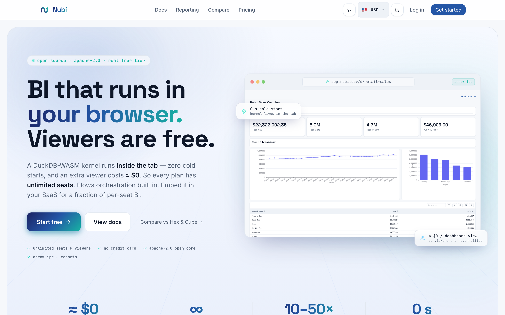 Light</td>
<td width="50%">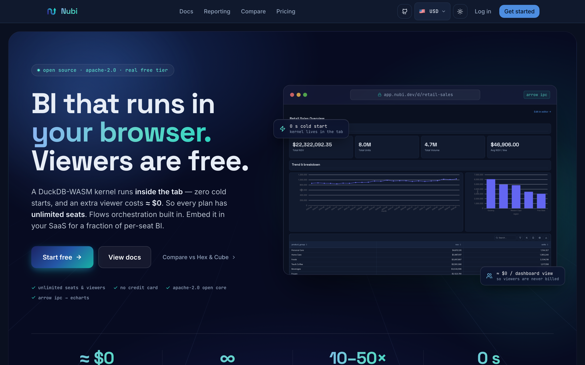 Dark</td>
</tr></table>

The landing page explains what Nubi is and links to pricing. Hit **Sign in** (top-right) or **Get started** to begin. See [Getting Started](/docs/getting-started) for the full sign-up walkthrough.

---

## The app shell

Every authenticated screen shares the same frame. Three regions are always visible; a fourth slides in on demand.

<table><tr>
<td width="50%">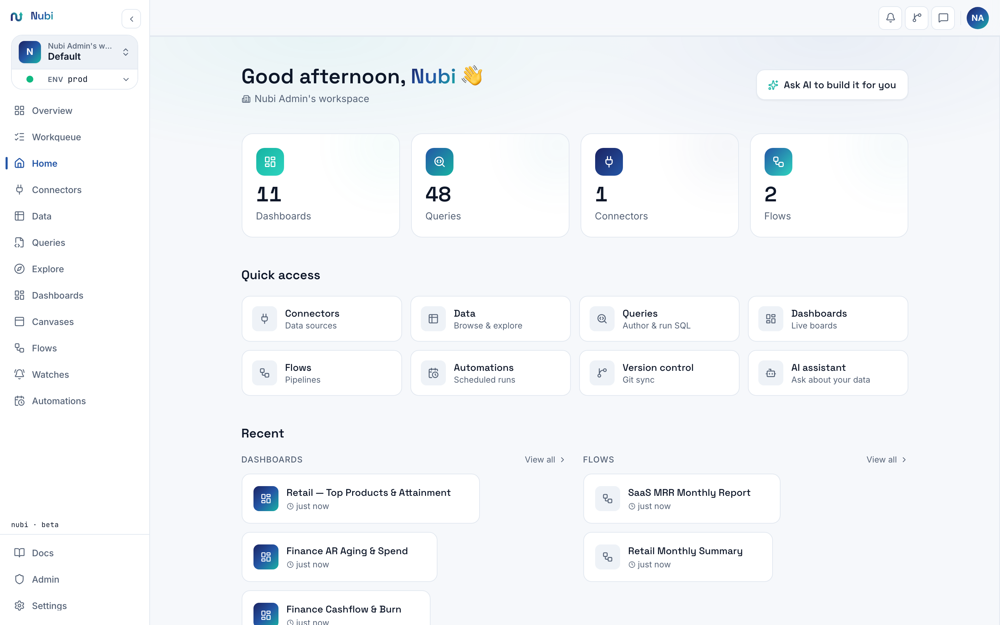 Light</td>
<td width="50%">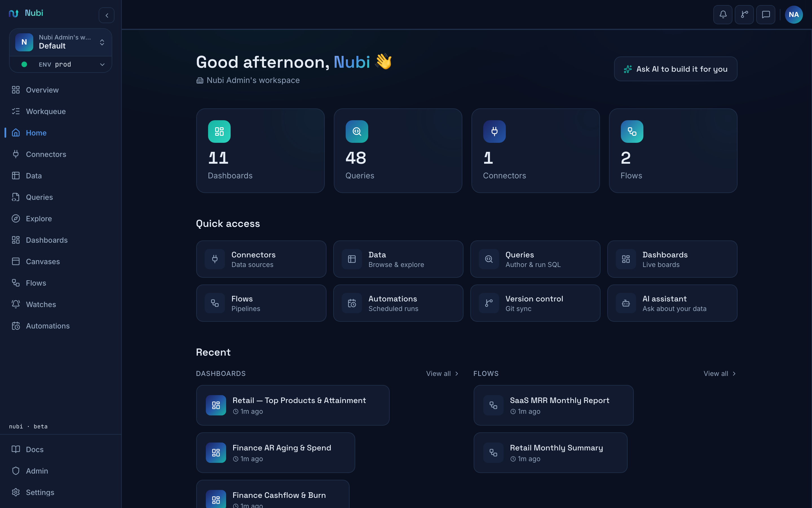 Dark</td>
</tr></table>

| Region | What it's for |
|--------|---------------|
| **Left sidebar** | Navigation plus the organisation, project, and environment switchers. Full-height; collapses to icons. |
| **Top bar** | Per-page toolbar slot (centre-left) and the chat toggle + account menu (right). |
| **Page content** | The route you navigated to. |
| **AI chat panel** | Slides in from the right edge; hidden until you open it. |

On mobile the sidebar is hidden behind an off-canvas drawer (hamburger in the top bar), and the chat panel becomes a full-screen overlay.

---

## The left sidebar

### Nubi logo

The logo at the top-left links back to the public landing page. Next to it is a chevron button that collapses the sidebar to a narrow icon strip and expands it again. Your preference is remembered across sessions. In collapsed mode, hover any icon to see its label as a tooltip.

### Organisation switcher

The **org selector** (building icon) sits directly below the logo. It shows the name of your active organisation. Click it to see all organisations you belong to and switch between them — a checkmark marks the active one. Every API request is scoped to the active org.

### Project switcher

The **project selector** (folder icon) sits directly below the org selector and follows the same pattern. Projects are workspaces inside an organisation — connectors, queries, dashboards, flows, and secrets all live within the active org and project.

To create a new project: open the dropdown and click **New project**, then type a name in the prompt that appears.

### Environment switcher

Below the project selector sits the **environment selector** — a pill with a coloured dot and the active environment name (`prod` by default). Environments namespace materialised targets and flow run artefacts so `dev` and `prod` runs never overwrite each other.

The hierarchy is **org → project → environment → resources**. Switching any selector refreshes the page content to reflect the new scope.

> Viewers (the `viewer` role) can browse everything but won't see create, edit, or run controls.

### Primary navigation

Below the selectors is the main nav. The active item shows a tinted background and a small dot on the right.

| Item | Route | What you'll do there |
|------|-------|----------------------|
| **Overview** | `/overview` | Executive at-a-glance view: workspace stat cards (connectors, queries, dashboards, flows), a data-health panel (overall score + RAG freshness dots per dataset), and a recent-activity feed. |
| **Workqueue** | `/workqueue` | "Needs attention" inbox, grouped into Alerts, Flow runs, and Stale data. When everything is healthy a green "All clear" banner is shown. |
| **Home** | `/home` | Setup progress, stat cards, quick-access grid, and recent dashboards and flows. |
| **Connectors** | `/connectors` | Add and manage data sources (Postgres, BigQuery, HTTP/JSON, and more). |
| **Data** | `/data` | Browse and explore your connectors' data: pick a connector, search its tables, then flip between Data (rows) and Schema (columns) tabs. |
| **Queries** | `/queries` | Author SQL in a Monaco editor, run queries, and save registered queries. |
| **Explore** | `/explore` | Metric explorer: select a metric, apply dimension filters, choose a time grain, and view results as a chart and table — no SQL required. |
| **Dashboards** | `/dashboards` | View, search, and open live dashboards. |
| **Canvases** | `/canvases` | HTML-native companion to dashboards — freeform layout with `<nubi-kpi>` / `<nubi-table>` / `<nubi-chart>` elements bound to registered queries. |
| **Flows** | `/flows` | Build multi-step pipelines — cells arranged as a canvas or notebook. |
| **Watches** | `/watches` | Proactive metric alerts: a watch monitors a governed metric against a threshold or change-over-time rule, and on breach sends an AI explanation to a notify channel. |
| **Automations** | `/automations` | Schedule flows and jobs to run on a cron schedule. |

### Secondary navigation

A divider separates two pinned items at the bottom of the sidebar:

- **Docs** (`/docs`) — in-app documentation viewer (the page you're reading now).
- **Settings** (`/settings`) — your profile, organisation, and project configuration.

Superadmins also see an **Admin** link that opens the internal admin console.

---

## The top bar

The top bar spans the full width of the content area and has two zones.

### Centre-left — the page toolbar slot

Each page mounts its own controls here. Simple pages leave it empty; editor-style pages fill it with context-relevant buttons. On the **Flows** page, for example, you'll see the save status, Validate, Save, and Run buttons here. Because the slot belongs to the current page, the controls change as you navigate.

### Right — chat toggle and account menu

Two controls sit at the far right:

1. **AI chat toggle** (message-square icon) — opens or closes the global chat panel. When a page owns its own embedded chat (e.g. the dashboard editor), this button is hidden to avoid duplication.
2. **Account menu** (your avatar or initials) — click it for your display name and email, a **Light mode / Dark mode** toggle, **Settings**, and **Sign out**.

---

## Light and dark theme

Nubi ships both themes.

- **Switch:** open the account menu (top-right avatar) and click **Light mode** or **Dark mode**.
- **First visit:** Nubi follows your operating-system preference until you pick one explicitly.
- **Sticky:** once you choose, it's remembered across sessions and the OS default is no longer followed.

---

## Overview (`/overview`)

Overview is the executive at-a-glance landing page for a workspace that is already set up.

<table><tr>
<td width="50%">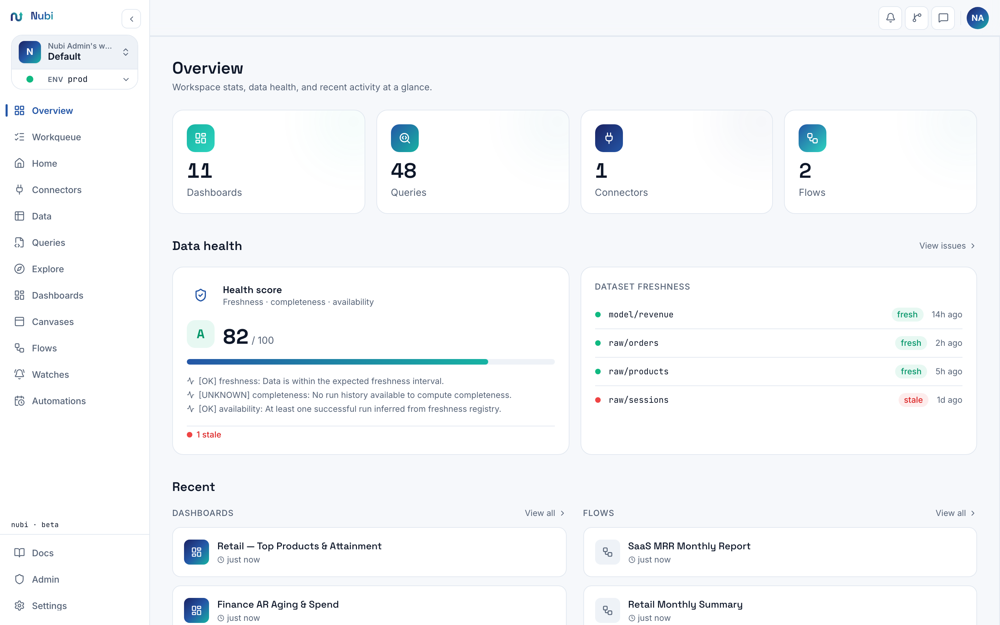 Light</td>
<td width="50%">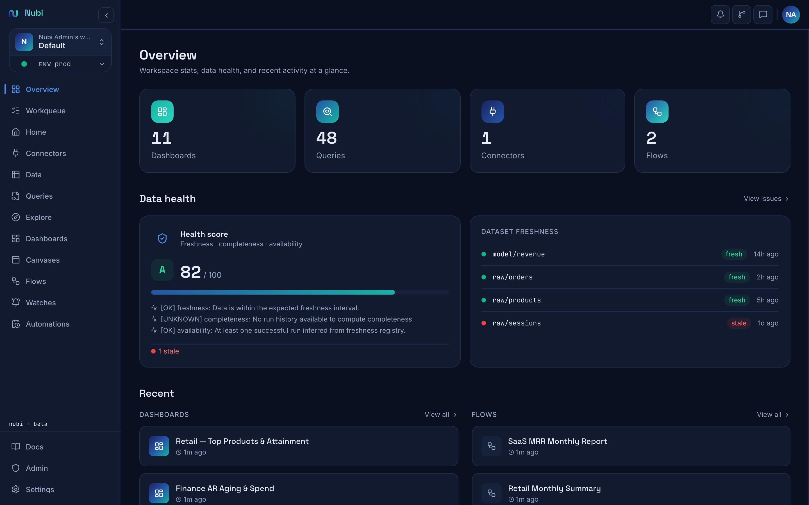 Dark</td>
</tr></table>

**Stat cards** — a row of four count cards: Connectors, Queries, Dashboards, Flows. Each card links to the corresponding section.

**Data health panel** — shows the overall health score (0–100 with a letter grade) and a freshness list for each of your datasets. Each dataset is shown as a RAG dot (green / amber / red) with its key and last-success timestamp. Click "View all" to open the full data-health detail. When any dataset is stale, the panel highlights it so you can jump straight there.

**Recent activity** — the two most recently updated dashboards and the two most recently updated flows, each as a clickable card showing name and relative timestamp.

**Quick-action buttons** — prominent shortcuts: "New dashboard", "New flow", and "Ask AI" (opens the chat panel).

All fetches are independently wrapped in error boundaries so a single 404 or empty payload never crashes the page. Overview is always available to any authenticated user, regardless of plan.

---

## Workqueue (`/workqueue`)

Workqueue is the "needs attention" inbox that surfaces actionable items in one place.

<table><tr>
<td width="50%">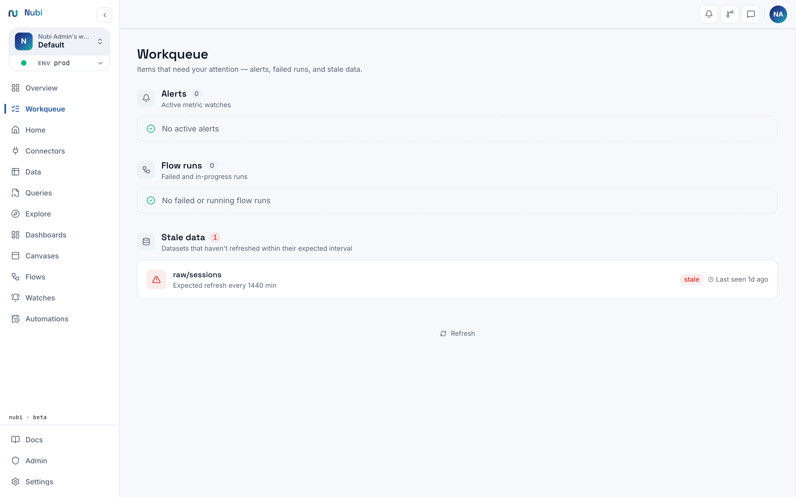 Light</td>
<td width="50%">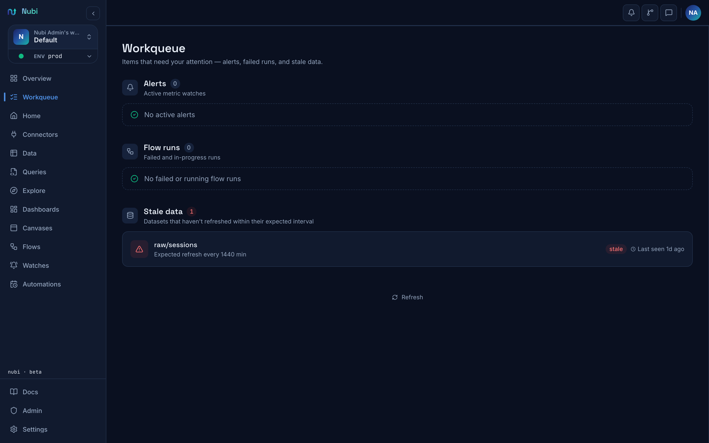 Dark</td>
</tr></table>

Three sections, each independent (a failure in one section never hides the others):

**Alerts** — every active watch in the org. Watches where the `enabled` flag is true are surfaced; any watch whose latest run indicates a threshold breach gets a "Breached" chip. Click a row to open the Watches section.

**Flow runs** — recent failed or still-running runs. Only runs with state `failed` or `running` are shown. Each row shows the flow name, run state chip (red for failed, blue for running), and relative timestamp. Clicking a row opens the flow detail.

**Stale data** — all datasets whose freshness status is `stale`. Each row shows the dataset key, the last success timestamp (or "never"), and the expected interval. Clicking a row opens the data-health detail view.

**Empty state** — when all three sections are empty the page shows a green "All clear — nothing needs attention" banner. A healthy Workqueue is the sign that your pipelines and data freshness are in good shape.

---

## Home (`/home`)

Home has two modes, chosen automatically based on workspace state.

<table><tr>
<td width="50%"> Light</td>
<td width="50%"> Dark</td>
</tr></table>

**Setup mode** — shown to new workspaces (or until you click **Skip setup**). Three step-cards guide you through the minimum path to a live dashboard:

1. Connect a data source → `/connectors`
2. Run your first query → `/queries`
3. Build a dashboard → `/editor`

A progress bar and a `n/3` counter track completion. A "What's next" row below the spine surfaces Flows, Automations, and Version control. Click **Skip setup** (top-right of the section) to jump directly to the general home; click **Resume setup** on the banner to return.

**General home** — shown once all three steps are done (or after skipping). It contains:

- **Stat row** — live counts for Dashboards, Queries, Connectors, and Flows. Each card links to that section.
- **Quick access grid** — one tile per feature surface, including an AI assistant tile that opens the chat panel.
- **Recent** — your most recently updated dashboards and flows.

An **Ask AI to build it for you** button in the header opens the chat panel from anywhere on Home.

---

## The environment selector

The **environment selector** lives in the sidebar, directly beneath the project switcher: a pill with the active environment name and a coloured dot. The selection is global app state — pages that run things target whichever environment is active here.

Environments namespace materialised targets and flow run artefacts so `dev` and `prod` runs never overwrite each other. They're per-project, and your choice is remembered per project.

| Environment | Dot colour | Notes |
|-------------|------------|-------|
| **prod** | green | The project default. The production target. |
| **dev** | blue | For development runs. |
| *custom* | violet | Any environment you add (e.g. `staging`). |

To switch or create an environment:

1. Click the environment pill in the sidebar.
2. Pick an environment from the dropdown — the active one shows a checkmark.
3. To add one, click **Add environment**, type a name, optionally seed from a git branch, and press **Enter** or **Add**.
4. To remove a custom environment, hover it and click the **×**.

---

## Connectors (`/connectors`)

<table><tr>
<td width="50%">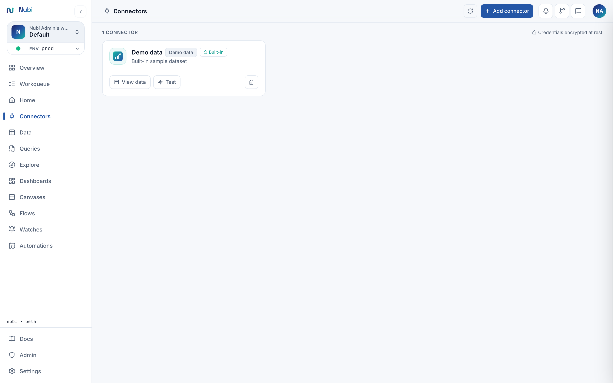 Light</td>
<td width="50%">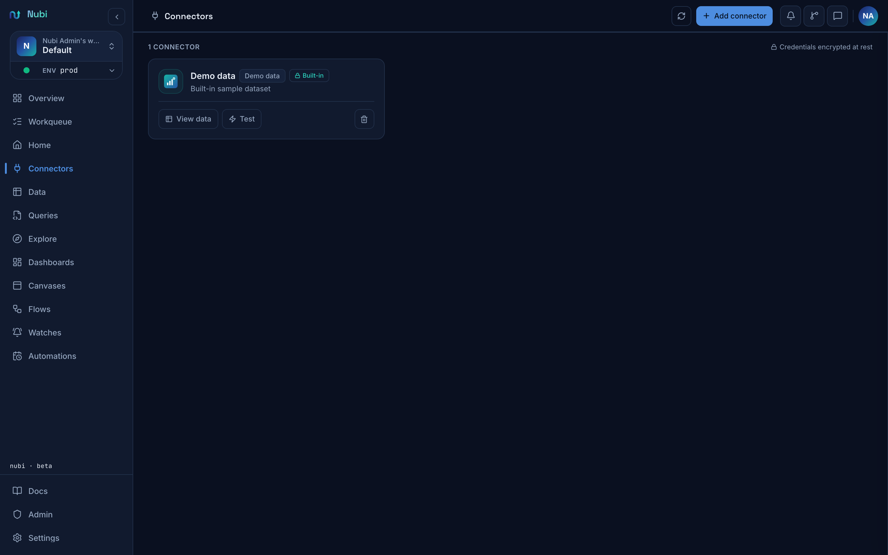 Dark</td>
</tr></table>

Connectors is where you link Nubi to your data sources. One card per source — Postgres, BigQuery, Snowflake, HTTP/JSON APIs, and 20+ more. Each card shows the logo, name, type badge, and summary config. The four card actions are **View data** (opens the Data Browser), **Test** (verifies config), **Edit**, and **Delete**.

Click **Add connector** to open a slide-over picker. Search or scroll through the category groups, fill in the connection details, and click **Add connector** to save. Your credentials are encrypted at rest with AES-256-GCM and are never returned by the API.

The **Managed lakehouse** panel at the top of the page lets you provision a Nubi-managed datastore — isolated, secure storage with no bucket to set up yourself.

See [Connectors](/docs/connectors) for the full supported-types list, credential handling details, and private-network bridge setup.

---

## Data browser (`/data`)

<table><tr>
<td width="50%">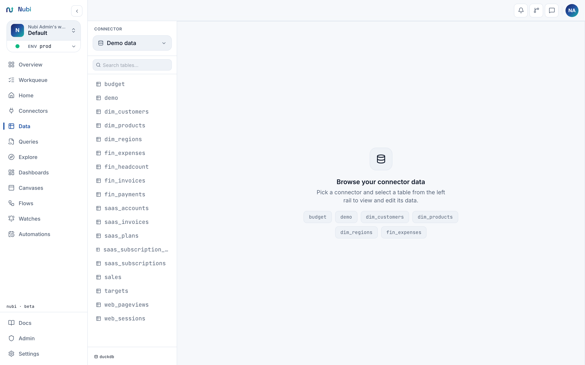 Light</td>
<td width="50%">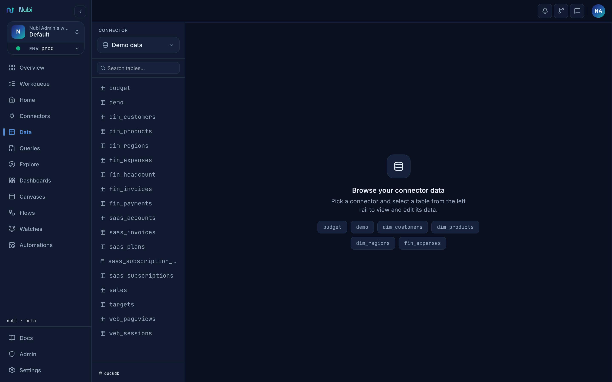 Dark</td>
</tr></table>

The Data browser lets you explore any connector's tables without writing SQL. Open it from the sidebar or click **View data** on a connector card.

- The **left rail** lists all tables for the selected connector (searchable, with row counts where available). The first table is auto-selected on load.
- The **right panel** shows the selected table's columns with their types (Schema tab) and the first 50 rows (Data tab).

This is also the fastest way to confirm a freshly added connector actually works — if you can see rows, the connection is good.

---

## Queries (`/queries`)

<table><tr>
<td width="50%">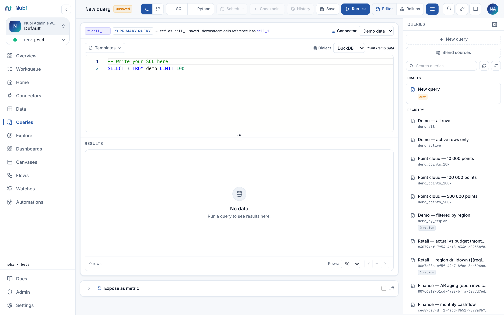 Light</td>
<td width="50%">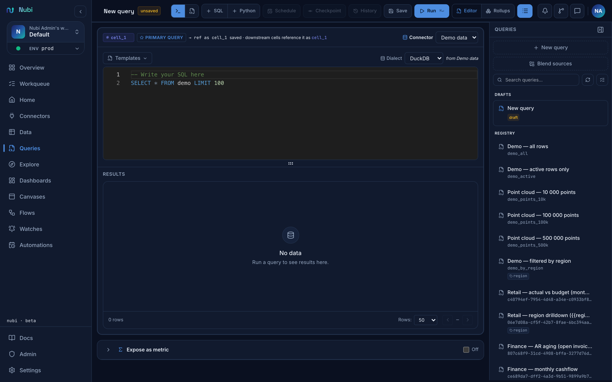 Dark</td>
</tr></table>

The Queries workspace is Nubi's SQL IDE. Write SQL against any connector, add `{{named}}` parameters, run to see results, and save the query to the registry so dashboards and flows can reuse it.

**Key areas:**

- **Primary query cell** — a Monaco SQL editor. Pick a connector in the toolbar, type your SQL, and press **Cmd/Ctrl + Enter** to run.
- **Results grid** — appears below the editor after a run, with row count, elapsed time, and a cache badge (HIT = served from cache at near-zero cost).
- **Parameters panel** — appears automatically when your SQL contains `{{param}}` placeholders. Each parameter gets a typed input field above the editor.
- **Queries panel** (right sidebar) — search and browse the query registry; open drafts or saved queries.
- **Scratch cells** — add extra SQL or Python cells below the primary query for exploration. Results from earlier cells are available in later cells by name (`cell_1`, `cell_2`, …).

**Saving** turns the draft into a registered query with a stable ID. Dashboards and flows reference queries by ID, so renaming a query later doesn't break anything. See [Queries & Parameters](/docs/queries-and-params) for full documentation.

---

## Explore (`/explore`)

<table><tr>
<td width="50%"> Light</td>
<td width="50%"> Dark</td>
</tr></table>

Explore is a no-SQL metric explorer powered by Nubi's governed metric layer. It surfaces the same `<nubi-metric-explorer>` web component that you can embed in your own app — so Explore also serves as an in-app dogfood of the embedding SDK.

**What you can do:**

1. **Pick a metric** — select from the governed metrics defined in your project (declared via the "Expose as metric" panel in the Queries workspace).
2. **Choose dimensions** — toggle one or more grouping dimensions to break the metric down (e.g. by region, product, plan type).
3. **Set a time grain** — day, week, month, quarter, or year, with an optional time comparison (e.g. period-over-period).
4. **Run** — Nubi executes the governed metric query (via `POST /metrics/{id}/query`) and shows the result as both a chart and a data table.

No raw SQL surfaces: Explore is the governed, analyst-safe way to slice a metric without writing code. The result updates live as you change dimensions or grain. See [AI, Chat & MCP](/docs/ai-and-mcp) and [Embed API](/docs/embed-api) for embedding the metric explorer in your own application.

---

## Dashboards (`/dashboards`)

<table><tr>
<td width="50%">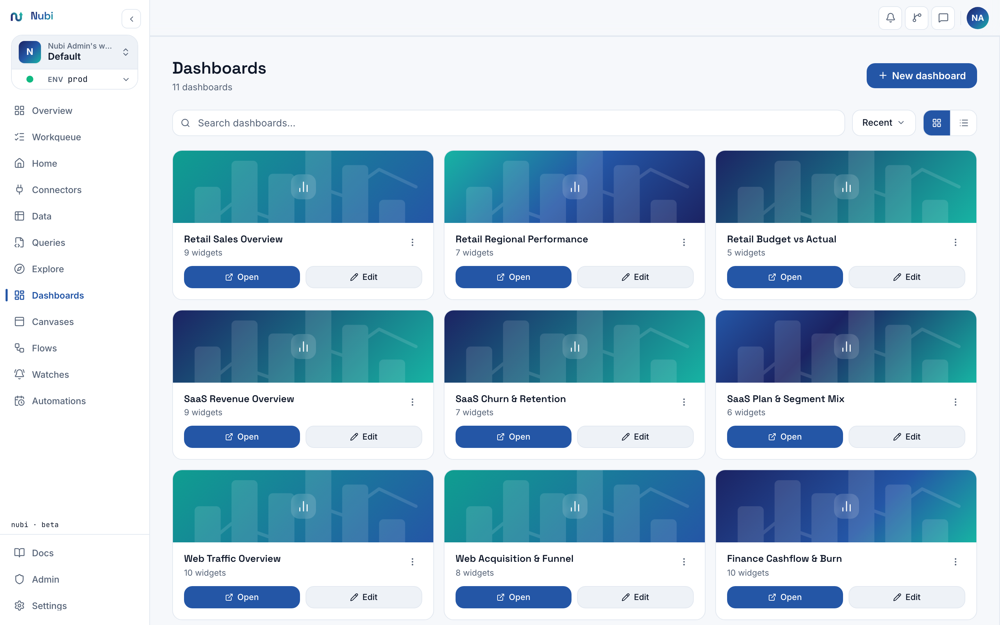 Light</td>
<td width="50%">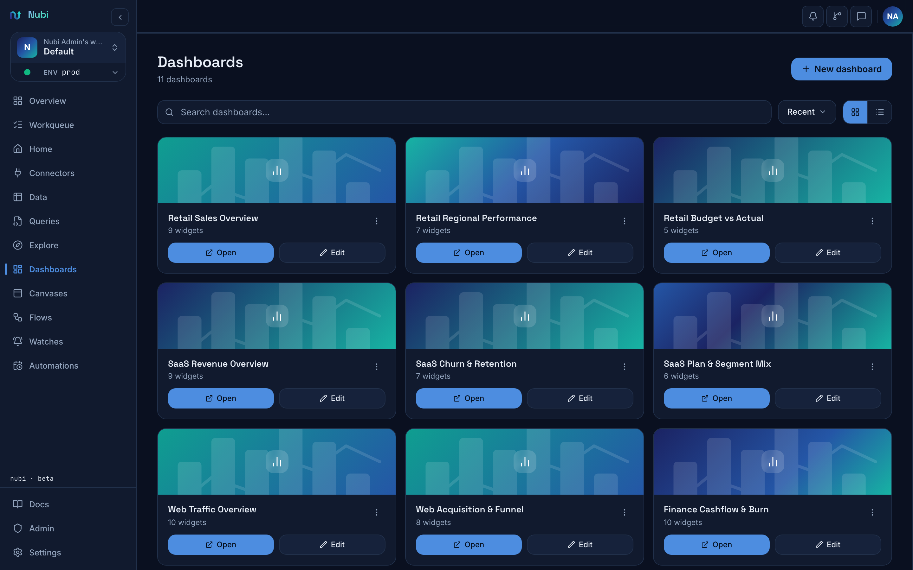 Dark</td>
</tr></table>

The Dashboards page lists every saved board in the active project as a responsive card grid. Each card shows the board name, widget count, and two primary actions — **Open** (view the live board) and **Edit** (open in the editor). The three-dot menu on each card adds Checkpoint, History, Promote, and Delete.

Click **New dashboard** (top-right) to open a blank editor. Or click **Ask AI to build one** to describe what you want in plain language — Nubi assembles a starting dashboard that you can then refine.

---

## Dashboard editor (`/editor`)

<table><tr>
<td width="50%">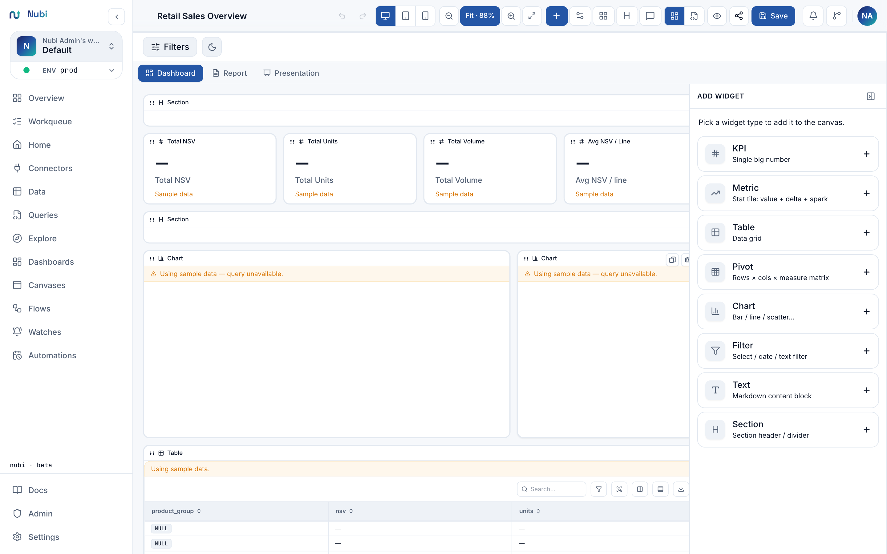 Light</td>
<td width="50%">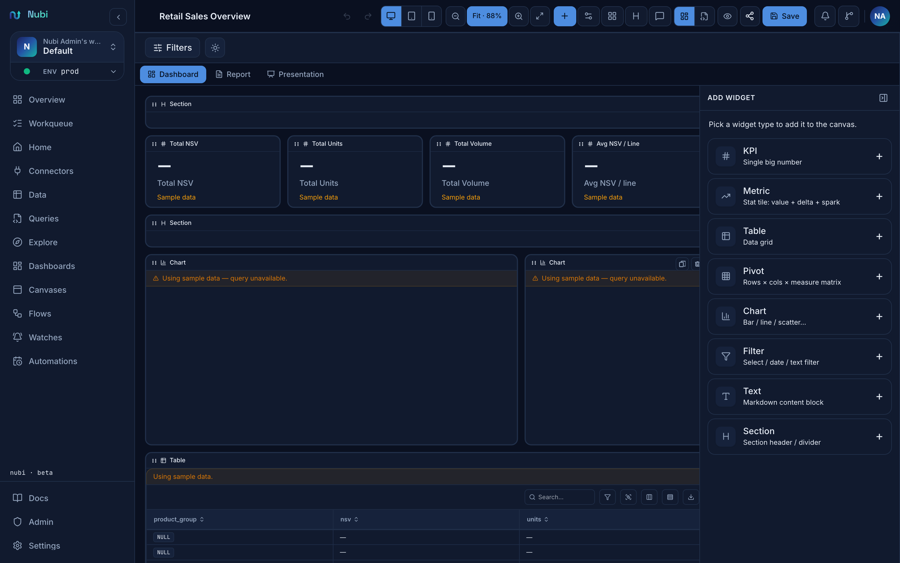 Dark</td>
</tr></table>

The editor is a single full-height workspace for building dashboards visually. Its toolbar lives in the top bar:

- **Title field** — name your dashboard.
- **Undo / Redo** — full edit history (`⌘Z` / `Ctrl+Z`).
- **Device switcher** — Desktop / Tablet / Mobile to set responsive layouts per breakpoint.
- **Panel toggles** — Add (widget palette), Configure (selected widget), Layout (dashboard-level settings), Tabs, Chat (AI assistant).
- **Preview / Edit** — flip between the editable canvas and a live render.
- **Code** — view or edit the full `DashboardSpec` as YAML/JSON in a Monaco slide-over.
- **Export / Share** — PNG, PDF, CSV, and an embed link.
- **Save / Create** — persists the board.

**Adding a widget:** click the **+** panel toggle, click a widget type (KPI, Metric, Chart, Table, Pivot, Filter, Text, or Section), and it drops onto the first free spot on the grid. Click the widget to configure it — bind a query, map columns, tune formatting.

**Arranging widgets:** drag the top-grip handle to move; drag the edge/corner handles to resize. Nudge with arrow keys; `Shift`+arrow resizes one grid cell at a time.

**Cross-filtering:** add a Filter widget, declare a dashboard variable, and bind other widgets' query parameters to that variable. When a viewer changes the filter, every bound widget re-queries.

See [Dashboards](/docs/dashboards) for the complete widget reference and DashboardSpec format.

---

## Dashboard live view (`/d/:id`)

<table><tr>
<td width="50%">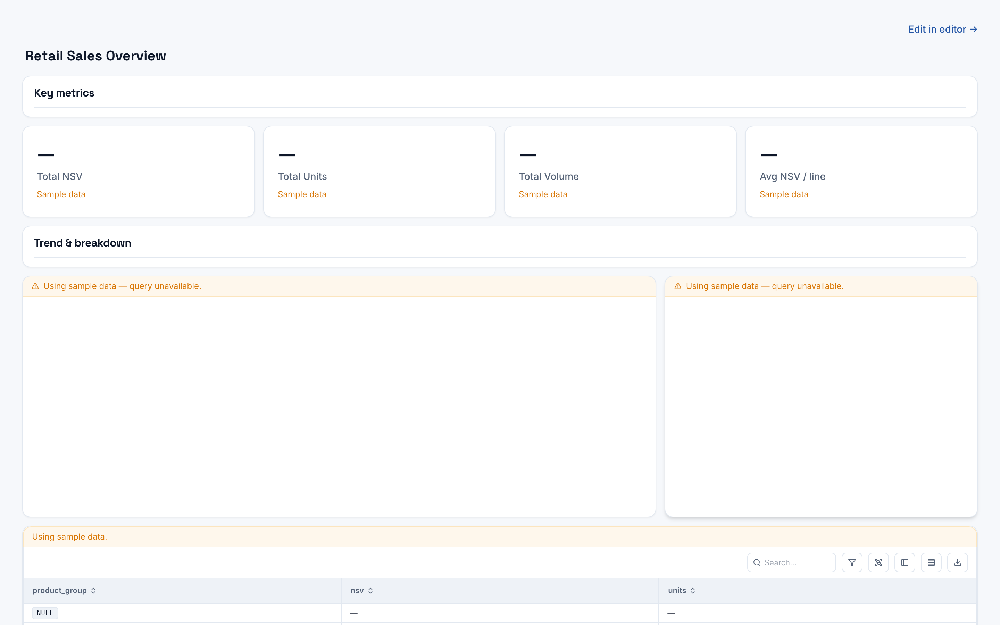 Light</td>
<td width="50%">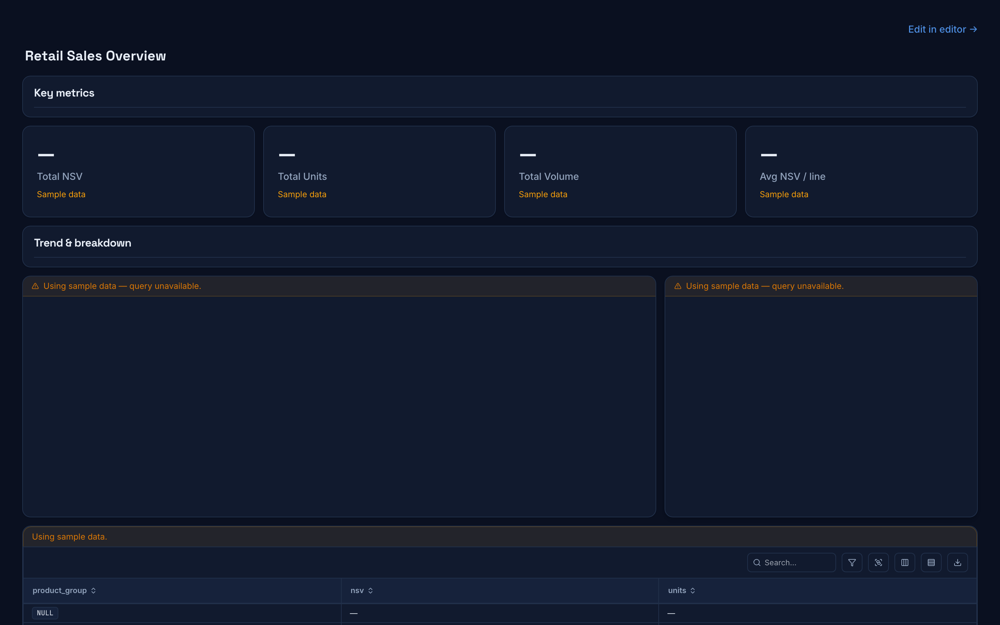 Dark</td>
</tr></table>

Opening a dashboard from the Dashboards list navigates to `/d/<id>` — a clean full-viewport view with no editor chrome. This is the URL you share with stakeholders, or embed via `<iframe>` or `<nubi-dashboard>`.

- Members who can write see an **Edit in editor →** link above the board; viewers get a clean read-only render.
- URL-bound dashboard variables sync to the query string, so filtered views are shareable and refresh-safe (e.g. `/d/abc123?region=US-West`).
- On a tabbed dashboard the active tab syncs to a `_tab` URL parameter.
- `/d/sample` renders a built-in sample dashboard — useful for previewing before any data is connected.

Use your browser's back button or the close control to return to the app shell.

---

## Flows (`/flows`)

<table><tr>
<td width="50%">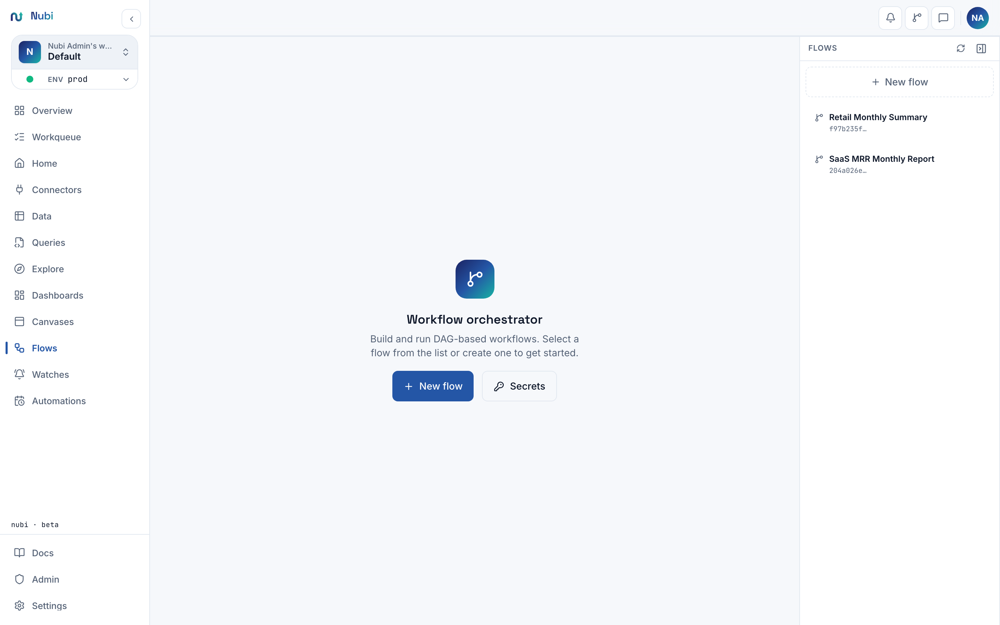 Light</td>
<td width="50%">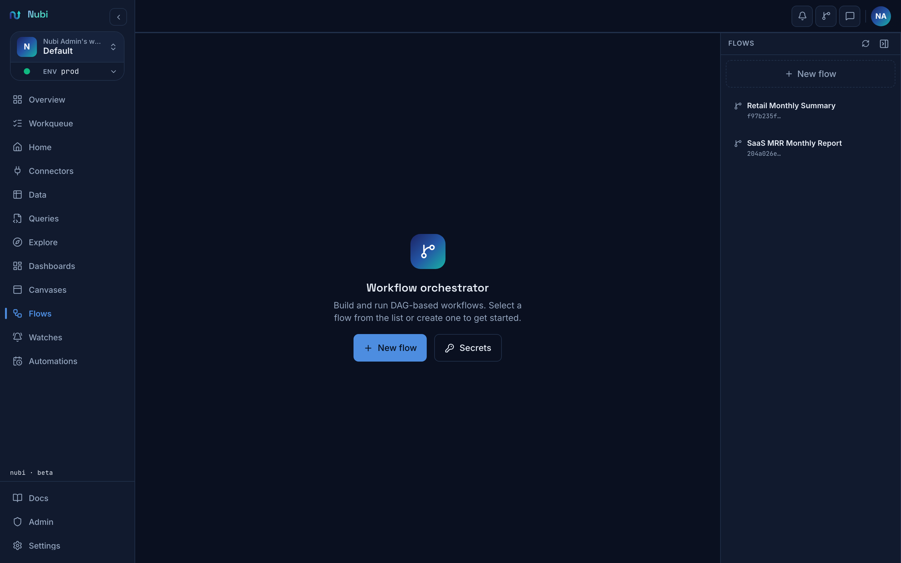 Dark</td>
</tr></table>

Flows is Nubi's built-in workflow orchestrator. A flow is a set of **cells** — SQL queries, Python scripts, or Markdown notes — wired into a directed acyclic graph. You can view and edit a flow in three ways:

- **Notebook view** — cells in a top-to-bottom list, each with its own Run button for fast interactive previews.
- **Canvas (DAG) view** — each cell is a node; arrows show dependencies. The clearest view for branching pipelines.
- **Code / Files view** — the flow projected as an editable file tree (`flow.py` plus one file per cell).

The **flow list** (right sidebar on desktop) shows all saved flows and any unsaved drafts. Click **New flow** to start one.

The **Runs tab** shows run history and the live run view — each node coloured by its current state (pending, running, success, failed, etc.). Click any node to see its result, logs, and error message.

See [Flows](/docs/flows) for the full cell reference, dependency wiring, materialization, scheduling, and version promotion.

---

## Settings (`/settings`)

<table><tr>
<td width="50%">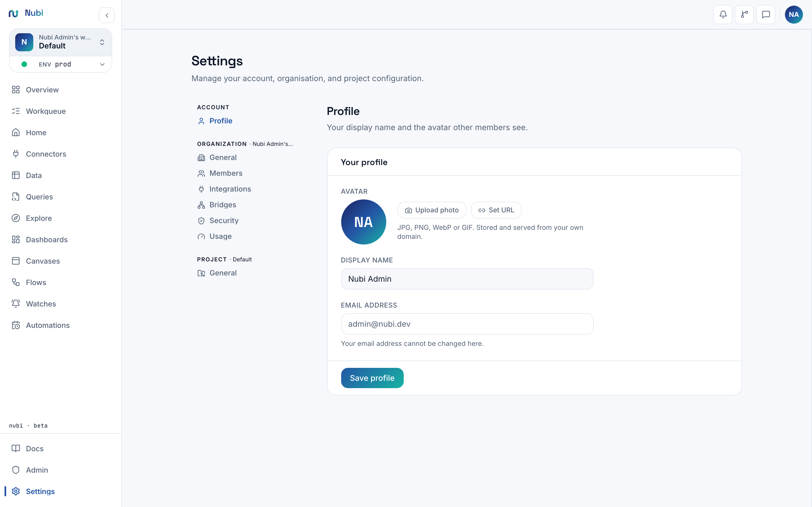 Light</td>
<td width="50%">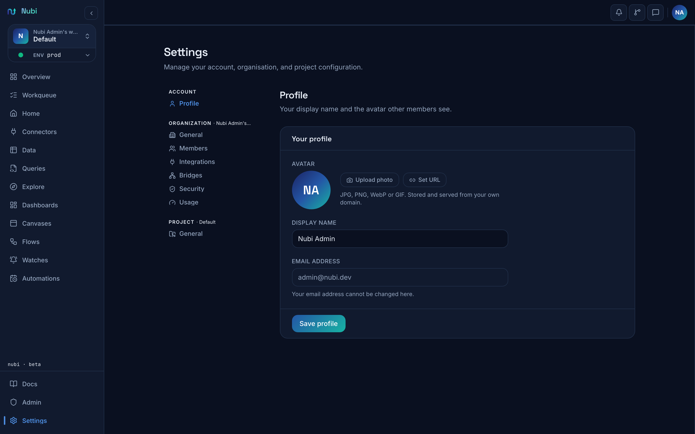 Dark</td>
</tr></table>

Navigate to **Settings** (sidebar bottom or account menu) to open the unified settings area. A grouped left sidebar keeps every setting in one place, organised by scope.

| Group | Section | Route | What's there |
|-------|---------|-------|--------------|
| **Account** | Profile | `/settings/profile` | Display name, avatar, email (read-only). |
| **Organization** | General | `/settings/organization` | Org name and other org-level settings. |
| | Members | `/settings/members` | Invite members, view roles, remove members. |
| | Integrations | `/settings/integrations` | Connect notify channels — Slack, WhatsApp, Google Chat, Teams, Email. |
| | Security | `/settings/security` | JWT issuers — register the public keys or JWKS endpoints your backend uses to sign embed tokens. |
| | Usage | `/settings/usage` | Read-only usage metering for the org — queries, compute, bytes scanned, flow runs, AI usage and more. |
| | Billing | `/billing` | Cloud/EE only. |
| **Project** | General | `/settings/project` | Project name and Git sync configuration. |

`/settings` redirects to `/settings/profile`. The settings sidebar is sticky on large screens so you can scan all sections without scrolling.

---

## The AI chat panel

Click the chat toggle (the message-square icon in the top bar) or any **Ask AI** button on Home to slide in the chat panel. Ask questions about your data in plain language — Nubi can run grounded text-to-SQL, draft dashboards, and drive an agentic tool loop on your behalf.

On desktop the panel shares the screen alongside your content (340 px wide). On mobile it opens full-screen. Close it with the toggle again or the panel's own close button. See [AI, Chat & MCP](/docs/ai-and-mcp) for the full capability reference.

---

## Pricing (`/pricing`)

<table><tr>
<td width="50%">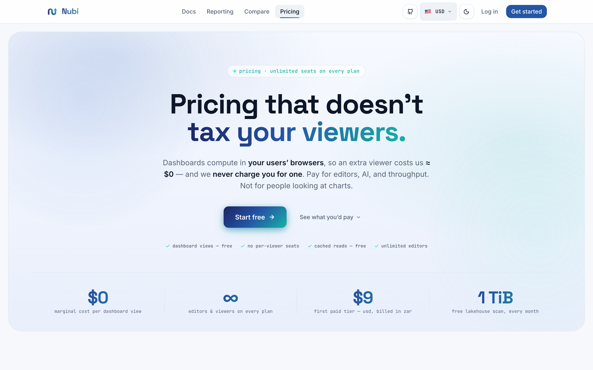 Light</td>
<td width="50%">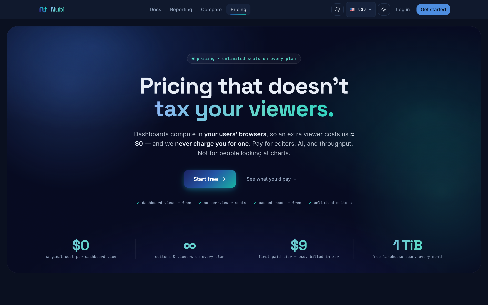 Dark</td>
</tr></table>

The pricing page is public — no sign-in required. It shows the five tiers (Free, Starter, Pro, Business, Enterprise), a feature comparison table, and a usage calculator. All plans include unlimited seats and viewers; Nubi does not charge per user. See [Billing & Usage](/docs/billing-and-usage) for full tier details.

---

## A first end-to-end pass

1. Open **Connectors** and add a data source (or use the built-in Demo data connector).
2. Open **Data** to browse the tables it exposes.
3. Open **Queries**, write a SQL query, run it, and save it as a registered query.
4. Open **Dashboards** and create a new dashboard (`/editor`), pulling in your registered query.
5. Open **Flows** to chain steps into a pipeline, then **Automations** to run it on a schedule.
6. Open **Watches** to get alerted — with an AI explanation — when a metric crosses a threshold.
7. Open **Explore** to slice and dice governed metrics without writing SQL.
8. Open the **AI chat panel** whenever you'd rather describe what you want than build it by hand.

That's the whole shell. The rest of these docs are deeper dives into each area:

[Getting Started](/docs/getting-started) · [Connectors](/docs/connectors) · [Queries & Parameters](/docs/queries-and-params) · [Dashboards](/docs/dashboards) · [Flows](/docs/flows) · [AI, Chat & MCP](/docs/ai-and-mcp) · [Embedding](/docs/embedding)
